Dalam implementasi Network Bound Disk Encryption (NBDE), media penyimpanan yang digunakan harus terlebih dahulu menerapkan enkripsi Linux Unified Key Setup (LUKS). Mekanisme enkripsi ini dirancang khusus untuk sistem operasi berbasis Linux, sehingga penerapannya terbatas pada lingkungan yang menggunakan distribusi Linux sebagai platform operasionalnya. 
 
Pada penelitian ini, implementasi Linux Unified Key Setup (LUKS) dilakukan menggunakan sistem operasi Arch Linux. Pemilihan Arch Linux didasarkan pada tingkat fleksibilitas dan kemudahannya dalam melakukan konfigurasi serta modifikasi sistem sesuai dengan kebutuhan server. Karakteristik tersebut memungkinkan penyesuaian komponen dan layanan yang dijalankan sehingga mendukung proses implementasi enkripsi secara optimal dan terkontrol.

Selain menggunakan Linux Unified Key Setup (LUKS), implementasi Network Bound Disk Encryption (NBDE) juga memerlukan beberapa aplikasi pendukung, antara lain Tang sebagai server otentikasi, Clevis sebagai klien untuk proses binding dan dekripsi otomatis, serta Firewalld sebagai pengelola aturan keamanan jaringan. Berikut ini merupakan penjelasan mengenai penggunaan aplikasi pendukung tersebut dalam mendukung implementasi NBDE secara menyeluruh.

 # Tang server
Tang adalah layanan yang digunakan untuk menghubungkan kunci kriptografi dengan kondisi atau keberadaan jaringan tertentu sehingga pemanfaatannya bergantung pada lingkungan jaringan yang telah ditentukan (ArchLinux,2026). Mekanisme ini memungkinkan proses pembukaan kunci (dekripsi) dilakukan secara otomatis apabila sistem berada pada lingkungan jaringan yang telah ditentukan dan dipercaya.Pendekatan ini meningkatkan aspek keamanan karena akses terhadap data tidak hanya bergantung pada kunci enkripsi, tetapi juga pada validasi kondisi jaringan yang digunakan.

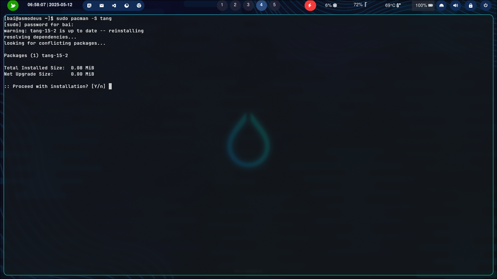

Aplikasi Tang pada dasarnya telah tersedia dalam repositori resmi pada beberapa sistem operasi berbasis Linux. Ketersediaan ini memudahkan administrator sistem dalam memperoleh paket instalasi yang terverifikasi dan terintegrasi dengan sistem manajemen paket distribusi yang digunakan.

Meskipun demikian, aplikasi tersebut tidak selalu terpasang secara bawaan pada saat instalasi awal sistem operasi. Oleh karena itu, diperlukan proses instalasi secara manual sebelum aplikasi dapat digunakan untuk mendukung implementasi Network Bound Disk Encryption (NBDE).

Proses instalasi dilakukan melalui mekanisme manajemen paket yang disediakan oleh masing-masing distribusi Linux. Setiap distribusi memiliki pengelola paket yang berbeda, sehingga perintah instalasi yang digunakan juga menyesuaikan dengan sistem yang diterapkan.

Pada sistem operasi Arch Linux, instalasi Tang dapat dilakukan menggunakan perintah manajemen paket sudo pacman -S tang. Perintah tersebut dijalankan melalui terminal dengan hak akses administratif untuk memastikan proses instalasi berjalan dengan baik.

Perintah tersebut berfungsi untuk mengunduh serta memasang paket Tang beserta seluruh dependensi yang dibutuhkan dari repositori resmi Arch Linux. Dengan demikian, sistem akan secara otomatis menyesuaikan kebutuhan pustaka dan komponen pendukung lainnya sehingga aplikasi dapat berjalan secara optimal sesuai dengan konfigurasi sistem yang digunakan.
 
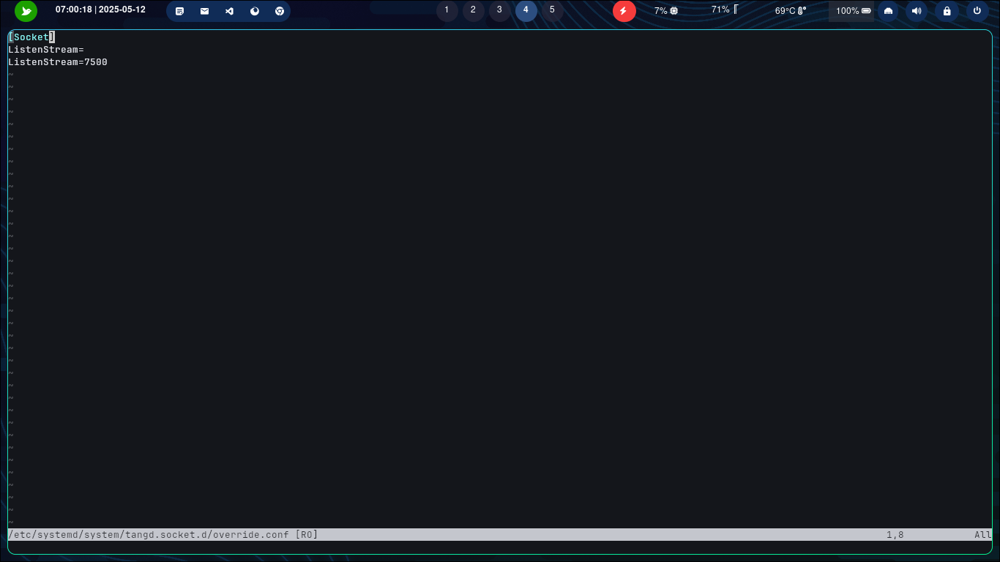

Setelah proses instalasi layanan Tang server selesai dilakukan, langkah selanjutnya adalah melakukan konfigurasi agar layanan tersebut dapat berjalan melalui port yang telah diberikan izin pada server. Konfigurasi ini dilakukan untuk memastikan bahwa layanan Tang dapat diakses oleh klien yang membutuhkan, khususnya dalam implementasi Network Bound Disk Encryption (NBDE). Tanpa konfigurasi port yang tepat, layanan tidak akan dapat berkomunikasi secara optimal melalui jaringan.

Port itu sendiri merupakan jalur komunikasi logis yang digunakan oleh sistem operasi untuk mengidentifikasi dan mengelola lalu lintas data antar layanan dalam suatu jaringan komputer. Setiap layanan atau aplikasi jaringan berjalan pada nomor port tertentu sehingga sistem dapat membedakan satu layanan dengan layanan lainnya dalam satu alamat internet yang sama. 

Dalam konfigurasi server, pembukaan dan pemberian izin terhadap port tertentu dilakukan melalui pengaturan firewall atau sistem keamanan jaringan yang digunakan. Proses ini bertujuan untuk menjaga keamanan server dengan membatasi akses hanya pada layanan yang diperlukan (Abu Bakar & Kijsirikul,2023). Oleh karena itu, selain memastikan port telah dibuka, peneliti juga perlu mempertimbangkan aspek keamanan agar layanan Tang dapat berjalan dengan aman dan terkontrol.

Pada penelitian ini port yang diberi akses merupakan 7500/tcp. Karena  secara teknis, layanan Tang secara default berjalan pada port 7500/TCP. Oleh karena itu, pembukaan port tersebut pada firewall server menjadi langkah yang diperlukan agar klien, seperti sistem operasi yang menggunakan Clevis, dapat terhubung dan melakukan proses Network Bound Disk Encryption (NBDE) tidak dapat berjalan.

Setelah layanan Tang terinstal dan port pada server telah dikonfigurasi sesuai dengan kebijakan keamanan jaringan yang berlaku, langkah selanjutnya adalah menjalankan layanan tersebut agar dapat beroperasi sebagaimana mestinya. Proses ini dilakukan untuk memastikan bahwa server Tang siap menerima permintaan koneksi dari klien yang akan melakukan proses pengambilan kunci enkripsi. Dengan menjalankan layanan, sistem akan mengaktifkan proses daemon Tang sehingga dapat merespons komunikasi jaringan melalui port yang telah dibuka sebelumnya.

Selain dijalankan secara manual, layanan Tang juga perlu dikonfigurasi agar aktif secara otomatis saat sistem server dinyalakan kembali setelah mengalami penghentian atau restart. Pengaturan ini bertujuan untuk menjaga ketersediaan layanan  sehingga mekanisme Network Bound Disk Encryption (NBDE) tetap dapat berjalan tanpa intervensi administrator setiap kali server mengalami gangguan daya atau pemeliharaan sistem. 

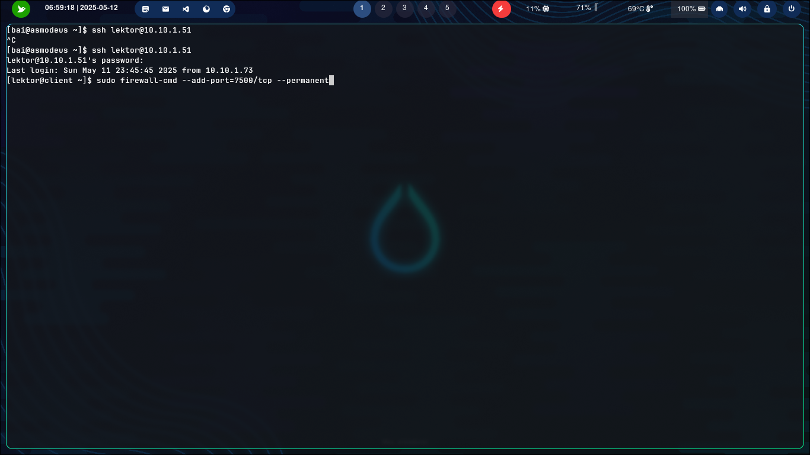
Sebagai tindak lanjut dari port yang sudah dikonfigurasi pada Tang server, maka harus melakukan penambahan port tersebut kedalam firewall server. Perintah pada gambar di atas digunakan untuk menambahkan aturan pada sistem firewall agar membuka akses terhadap port 7500 dengan protokol TCP secara permanen. Perintah tersebut dijalankan dengan hak akses administratif (superuser) menggunakan sudo, karena perubahan konfigurasi firewall memerlukan izin tingkat sistem. 

Dalam konteks implementasi layanan Tang pada server, pembukaan port 7500/TCP ini bertujuan untuk memastikan bahwa layanan dapat diakses oleh klien melalui jaringan. Tanpa penambahan port ini, firewall berpotensi memblokir lalu lintas masuk menuju port yang digunakan oleh layanan, sehingga proses komunikasi antara server dan klien tidak dapat berlangsung. Oleh karena itu, pengaturan firewall menjadi bagian penting dalam tahapan konfigurasi sistem guna menjamin ketersediaan layanan sekaligus tetap mempertahankan kontrol keamanan jaringan.

# clevis
Selain layanan Tang pada sisi server, implementasi Network Bound Disk Encryption (NBDE) juga memerlukan komponen pendukung pada sisi klien, yaitu Clevis. Clevis merupakan perangkat lunak yang berfungsi sebagai automated decryption framework yang memungkinkan proses pembukaan kunci enkripsi dilakukan secara otomatis berdasarkan kebijakan tertentu. Dalam konteks NBDE, Clevis digunakan untuk melakukan binding antara sistem terenkripsi seperti LUKS dengan layanan Tang sebagai penyedia kunci di jaringan, sehingga proses dekripsi dapat berlangsung tanpa interaksi manual saat sistem melakukan booting (Red Hat, 2023).

Lebih lanjut, Clevis bekerja dengan mengimplementasikan konsep policy-based decryption, di mana kunci enkripsi tidak disimpan secara langsung dalam sistem, melainkan diperoleh melalui mekanisme autentikasi terhadap layanan yang telah dikonfigurasi sebelumnya. Mekanisme ini meningkatkan aspek keamanan karena kunci hanya dapat diperoleh apabila klien berada dalam lingkungan jaringan yang sesuai dengan kebijakan yang telah ditentukan. Dengan demikian, Clevis berperan sebagai penghubung antara sistem terenkripsi dengan server Tang dalam skema NBDE, sehingga memungkinkan proses dekripsi otomatis berjalan secara aman dan terkontrol.

Sejalan dengan mekanisme tersebut, integrasi antara Clevis dan Tang memungkinkan terciptanya sistem enkripsi disk yang tidak bergantung pada input kata sandi secara manual saat proses booting berlangsung. Oleh karena itu, penggunaan Clevis pada sisi klien menjadi komponen pendukung keberhasilan implementasi Network Bound Disk Encryption secara menyeluruh.

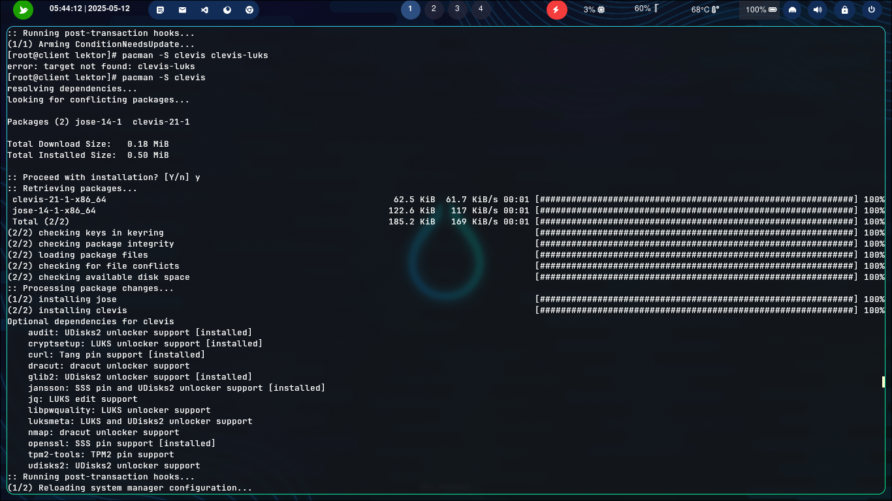

Perintah pada gambar diatas merupakan perintah untuk melakukan instalasi paket atau layanan clevis yang terdapat pada sistem operasi Archlinux. Dengan menjalankan perintah tersebut, sistem akan mengunduh paket Clevis beserta dependensi yang dibutuhkan sehingga layanan dapat digunakan pada sisi klien dalam implementasi Network Bound Disk Encryption (NBDE).

Setelah proses instalasi selesai dilakukan, Clevis dapat dikonfigurasi untuk melakukan proses binding antara volume terenkripsi LUKS dengan server Tang sebagai penyedia kebijakan dekripsi berbasis jaringan. Sebagaimana dijelaskan dalam dokumentasi resmi Red Hat (2024), Clevis berfungsi sebagai automated decryption framework yang memungkinkan pembukaan volume terenkripsi secara otomatis berdasarkan kebijakan tertentu tanpa memerlukan input kata sandi secara manual saat proses booting. Dengan demikian, instalasi Clevis merupakan tahapan awal yang krusial sebelum dilakukan konfigurasi lanjutan dalam skema NBDE.

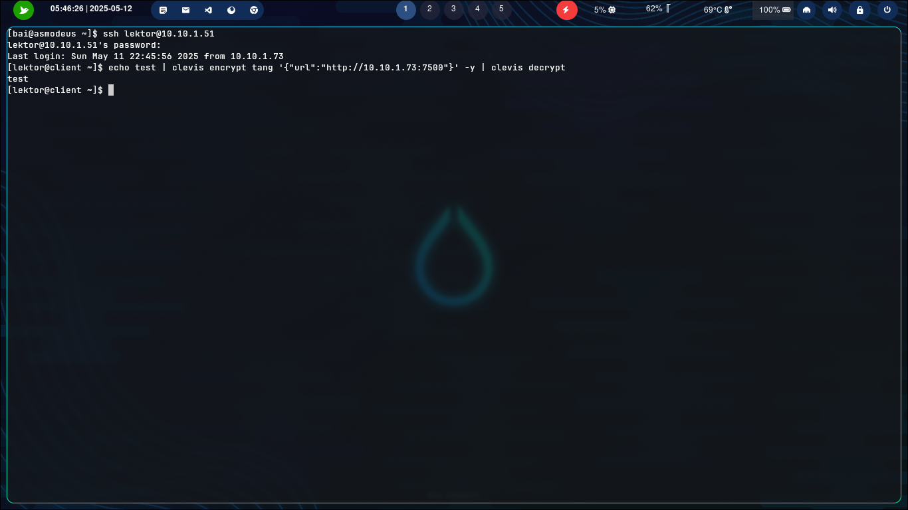

Setelah proses instalasi dan konfigurasi layanan Tang pada sisi server serta Clevis pada sisi klien selesai dilakukan, tahapan berikutnya adalah melakukan pengujian konektivitas terhadap layanan Tang sebelum proses binding diterapkan pada media penyimpanan yang terenkripsi. Pengujian ini bertujuan untuk memastikan bahwa layanan Tang dapat diakses melalui jaringan serta merespons permintaan klien dengan baik sesuai dengan konfigurasi port dan firewall yang telah ditetapkan. 

Apabila layanan Tang tidak dapat diakses atau terjadi kesalahan dalam komunikasi jaringan, maka Clevis tidak akan mampu memperoleh kebijakan dekripsi yang dibutuhkan untuk membuka media penyimpanan yang  terenkripsi. Kondisi ini berpotensi menyebabkan kegagalan mekanisme automatic unlocking dalam skema NBDE, sehingga sistem memerlukan intervensi manual untuk memasukkan kata sandi enkripsi. Oleh karena itu, tahapan pengujian konektivitas menjadi bagian penting dalam memastikan keberhasilan implementasi Network Bound Disk Encryption secara menyeluruh. 

# kernel parameter
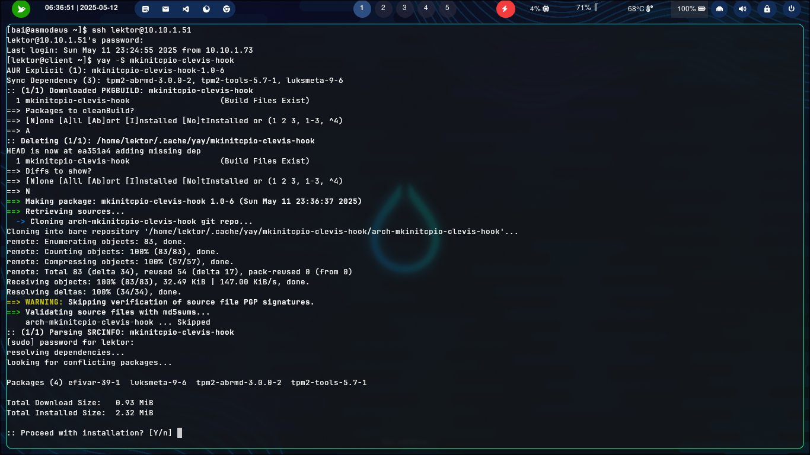
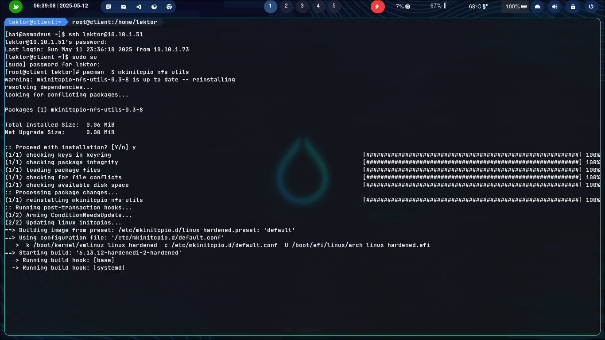
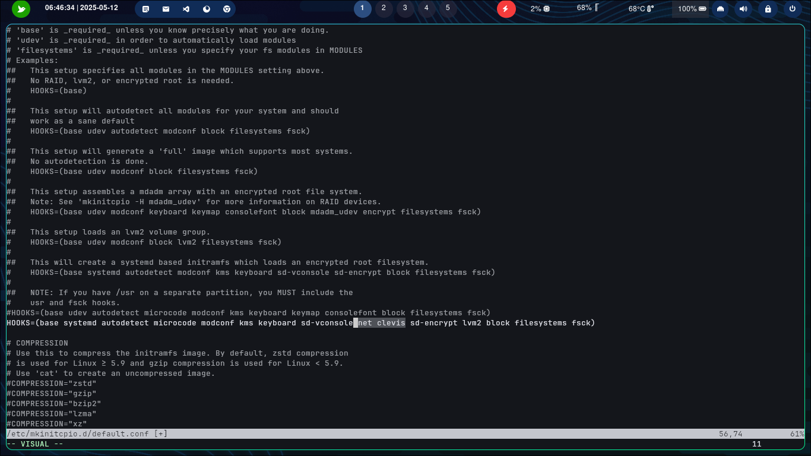
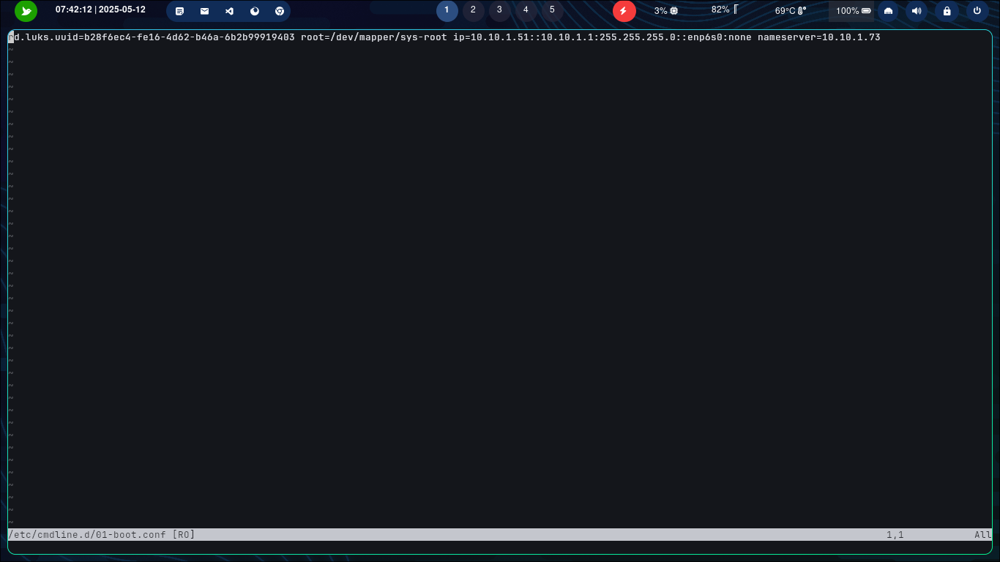

## binding
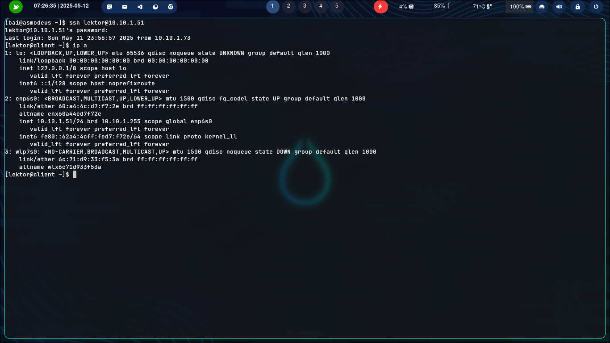
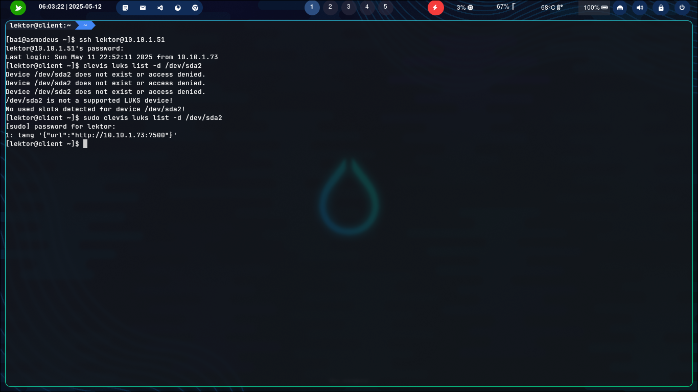
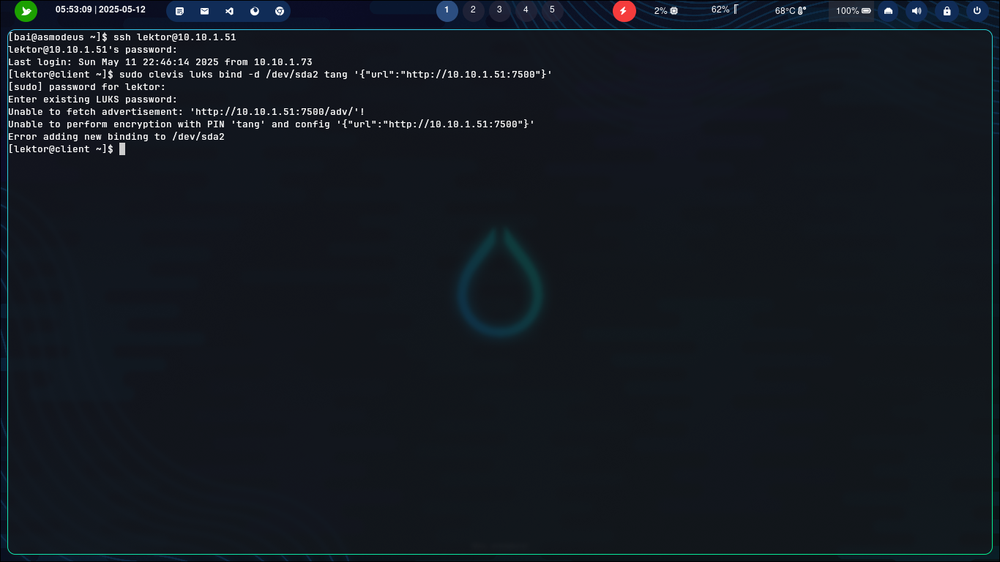
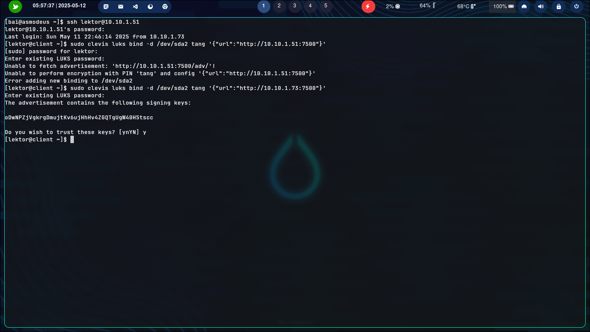 
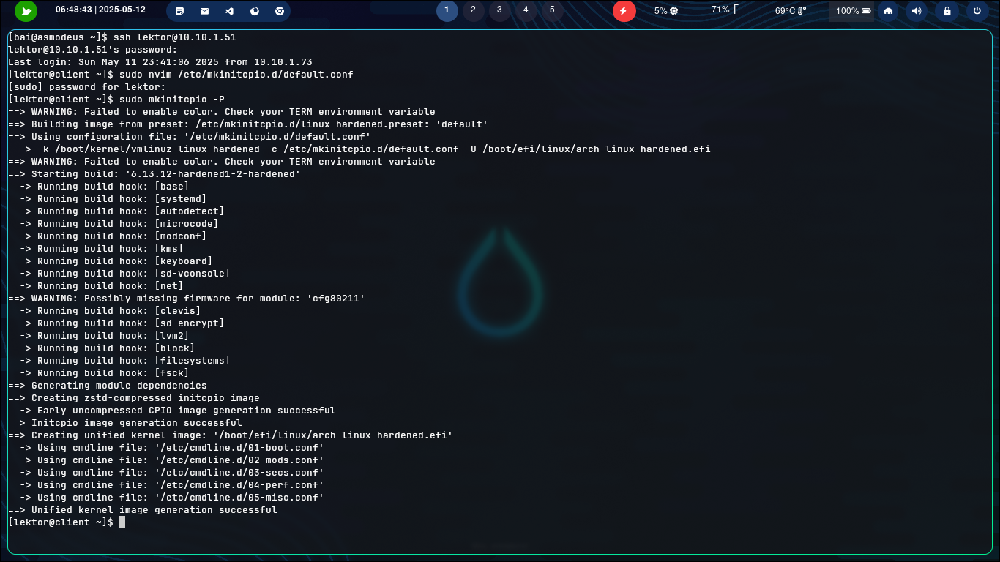 
 
 
  
 

