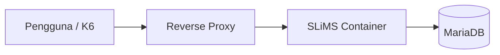
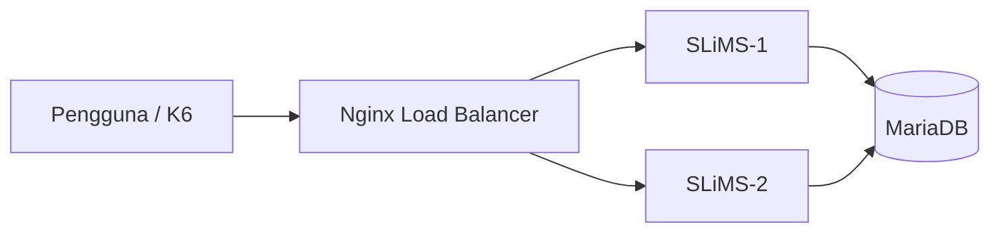

# BAB IV HASIL DAN PEMBAHASAN

Bab ini menyajikan hasil penelitian yang diperoleh melalui tahapan pengembangan sistem menggunakan pendekatan **Design and Development Research (DDR)**. Sesuai dengan karakteristik metode DDR, penelitian tidak hanya berfokus pada hasil akhir berupa produk, tetapi juga menggambarkan proses identifikasi masalah, analisis kebutuhan, perancangan, implementasi, pengujian, hingga evaluasi terhadap sistem yang dikembangkan (Richey & Klein, 2007).

Tahapan pembahasan dimulai dari identifikasi kondisi eksisting sistem otomasi perpustakaan yang digunakan pada Organisasi N melalui observasi dan wawancara, kemudian dilanjutkan dengan proses pengembangan infrastruktur menggunakan pendekatan **Load Balancing** untuk meningkatkan performa layanan dan mendukung **High Availability**.

# 4.4 Perancangan Pengembangan Sistem

Tahap perancangan dilakukan berdasarkan kebutuhan yang telah diidentifikasi sebelumnya.

Pengembangan sistem dirancang menggunakan komponen:

* Container aplikasi SLiMS;
* Database MariaDB;
* Reverse Proxy Nginx sebagai Load Balancer;
* Jaringan internal container.

---

# 4.5 Implementasi Sistem

Tahap implementasi dilakukan dengan membangun dua kondisi pengujian sebagai bahan evaluasi.

## 4.5.1 Implementasi Arsitektur Monolitik

Pada tahap ini aplikasi dijalankan menggunakan satu instance layanan.

**Gambar 4.2 Implementasi Arsitektur Monolitik**

Keterangan:
Masukkan screenshot container, konfigurasi, dan hasil implementasi.

### 4.5.1.1 Membuat Jaringan Docker 

### 4.5.1.2 Menjalankan _image database_

### 4.5.1.3 Status _service database_

### 4.5.1.4 Menjalankan _image sistem otomasi perpustakaan_

### 4.5.1.5 Status _service sistem otomasi perpustakaan_

### 4.5.1.6 Memindahkan folder sistem otomasi perpustakaan

### 4.5.1.7 Konfigurasi _stress test_

---

## 4.5.2 Implementasi Arsitektur Load Balancing

Tahap berikutnya dilakukan implementasi pengembangan menggunakan dua instance aplikasi dan satu reverse proxy.

**Gambar 4.3 Implementasi Arsitektur Load Balancing**

Keterangan:
Masukkan screenshot topologi, container, dan konfigurasi.

---

# 4.6 Pengujian Sistem

Pengujian dilakukan menggunakan metode **load testing** menggunakan K6.

### Tabel 4.2 Skenario Pengujian

| Parameter    |              Nilai |
| ------------ | ------------------: |
| Virtual User |                 500 |
| Durasi       |             4 menit |
| Metode       |        Load Testing |
| Tool         |                  K6 |
| Endpoint     | Halaman utama SLiMS |

Pengujian dilakukan pada dua skenario:

1. Arsitektur monolitik
2. Arsitektur load balancing

---

## 4.6.1 Menjalankan Pengujian Monolitik

## 4.6.1 Hasil Pengujian Monolitik

**Gambar 4.4 Hasil Pengujian Monolitik**

Berdasarkan hasil pengujian monolitik diperoleh bahwa:

Total request berhasil diproses sebesar 27.306 request
Tingkat keberhasilan pengujian sebesar 99,39%
Request gagal sebesar 0,60%
Rata-rata waktu respons sebesar 1,09 detik
Persentil ke-95 (P95) sebesar 84,56 ms

Hasil tersebut menunjukkan bahwa ketika beban meningkat hingga 500 pengguna virtual secara bersamaan, sistem monolitik mulai menunjukkan keterbatasan kapasitas yang ditandai dengan meningkatnya waktu respons dan munculnya request yang gagal diproses.

---

## 4.6.2 Menjalankan Pengujian Load Balancer

## 4.6.2 Hasil Pengujian Load Balancer

**Gambar 4.4 Hasil Pengujian Load Balancer**

Berdasarkan hasil pengujian load balancing diperoleh bahwa:

Total request berhasil diproses sebesar 53.561 request
Tingkat keberhasilan mencapai 100%
Tidak ditemukan request gagal
Rata-rata waktu respons sebesar 11,31 ms
Persentil ke-95 (P95) sebesar 19,27 ms

Hasil tersebut menunjukkan bahwa distribusi beban berhasil meningkatkan kemampuan sistem dalam menangani permintaan secara simultan.

---

# 4.7 Analisis Hasil Pengujian

Tahap ini dilakukan untuk membandingkan performa kedua arsitektur.

### Tabel 4.3 Perbandingan Hasil Pengujian

| Indikator         | Monolitik | Load Balancing |
| ----------------- | --------: | -------------: |
| Total Request     |    27.306 |         53.561 |
| Success Rate      |    99,39% |           100% |
| Failed Request    |     0,60% |             0% |
| Avg Response Time |    1,09 s |       11,31 ms |
| P95               |  84,56 ms |       19,27 ms |

Berdasarkan hasil pengujian dilakukan interpretasi terhadap perubahan performa sistem setelah diterapkan distribusi beban.

---

# 4.8 Evaluasi Pengembangan Berdasarkan Design and Development Research

Tahap evaluasi dilakukan sebagai bagian akhir dari pendekatan DDR.

Evaluasi dilakukan dengan membandingkan kondisi sebelum dan sesudah pengembangan berdasarkan hasil implementasi dan pengujian.

Hasil evaluasi menjadi dasar untuk menentukan apakah sistem yang dikembangkan telah memenuhi tujuan penelitian yaitu meningkatkan performa, efisiensi distribusi beban, serta mendukung ketersediaan layanan.

---

### Referensi

Richey, R. C., & Klein, J. D. (2007). *Design and Development Research: Methods, Strategies, and Issues*. Routledge.

Noruzi, A. (2004). *Application of Ranganathan’s Laws to the Web*. Webology.
