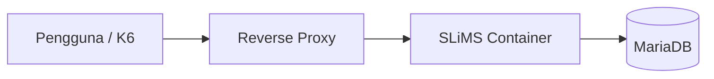
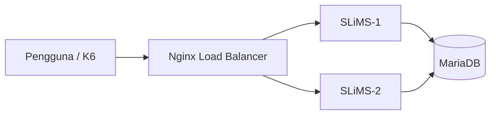

# BAB IV HASIL DAN PEMBAHASAN

Bab ini membahas proses pengembangan sistem yang dilakukan dalam penelitian mulai dari landasan implementasi, spesifikasi lingkungan pengujian, perancangan topologi, implementasi sistem, pengujian performa, hingga evaluasi hasil pengembangan. Seluruh tahapan disusun berdasarkan pendekatan **Design and Development Research (DDR)** yang menekankan hubungan antara proses desain, pengembangan, implementasi, dan evaluasi produk secara empiris (Richey & Klein, 2007).

Pengembangan sistem pada penelitian ini dilakukan untuk menjawab permasalahan penurunan performa layanan sistem otomasi perpustakaan pada Organisasi N ketika menghadapi peningkatan jumlah permintaan pengguna secara bersamaan. Permasalahan tersebut dianalisis dan dijawab melalui penerapan mekanisme **Load Balancing** berbasis container yang dirancang untuk meningkatkan kemampuan distribusi beban kerja sekaligus menjaga ketersediaan layanan.

---

## 4.1 Landasan Implementasi Pengembangan Sistem

Tahap pengembangan sistem pada penelitian ini didasarkan pada kebutuhan untuk meningkatkan performa layanan sistem otomasi perpustakaan melalui pendekatan distribusi beban kerja. Secara konseptual, penggunaan **Load Balancer** dipilih karena memiliki kemampuan untuk mendistribusikan permintaan pengguna ke beberapa server secara merata sehingga mengurangi risiko terjadinya penumpukan trafik pada satu titik layanan.

Menurut Nance dan Hay (2020), load balancer berfungsi sebagai komponen yang mengoptimalkan penggunaan sumber daya dengan cara mengatur distribusi lalu lintas jaringan agar seluruh server dapat bekerja secara seimbang. Penerapan mekanisme tersebut memungkinkan peningkatan kapasitas pemrosesan tanpa harus meningkatkan spesifikasi perangkat secara vertikal.

Dari perspektif **High Availability**, distribusi beban memberikan keuntungan tambahan berupa kemampuan mempertahankan layanan ketika salah satu node mengalami gangguan. Sistem tetap dapat beroperasi karena permintaan pengguna dialihkan menuju node lain yang masih aktif (F5 Networks, 2024).

Implementasi ini juga sejalan dengan teori **The Five Laws of the Web** yang dikemukakan oleh Noruzi (2004), khususnya pada hukum keempat *Save the time of the user* dan hukum kelima *The Web is a growing organism*. Infrastruktur yang mampu merespons permintaan secara cepat dan dapat berkembang mengikuti peningkatan kebutuhan pengguna merupakan karakteristik yang ingin dicapai melalui penerapan load balancing.

Selain itu, pendekatan ini mendukung prinsip **Cloud Computing** yang menekankan fleksibilitas, skalabilitas, dan efisiensi penggunaan sumber daya komputasi (Mell & Grance, 2011).

Berdasarkan landasan teoritis tersebut, penelitian ini mengembangkan dua pendekatan arsitektur yang akan dibandingkan, yaitu:

1. Arsitektur monolitik (single application instance).
2. Arsitektur berbasis load balancing (multiple application instance).

---

## 4.2 Spesifikasi Lingkungan Pengujian (Laboratory Testing)

Tahap berikutnya adalah penyusunan lingkungan laboratorium yang digunakan sebagai media implementasi dan pengujian sistem.

Sesuai metode yang telah dijelaskan pada Bab III, penelitian ini menggunakan pendekatan **laboratory testing** agar seluruh variabel pengujian dapat dikendalikan dan hasil pengamatan dapat dilakukan secara konsisten.

Lingkungan pengujian dibangun menggunakan teknologi container sehingga memungkinkan replikasi sistem dilakukan dengan konfigurasi yang seragam pada setiap node aplikasi.

Arsitektur laboratorium terdiri atas:

* **2 Container aplikasi SLiMS**
* **1 Container database**
* **1 layanan Load Balancer (Nginx)**
* **Docker Network Internal**

Seluruh container aplikasi menggunakan konfigurasi sumber daya yang seragam agar hasil pengujian tidak dipengaruhi perbedaan kapasitas perangkat.

### Tabel 4.1 Spesifikasi Lingkungan Pengujian

| Komponen                  | Spesifikasi  |
| ------------------------- | ------------ |
| Sistem Operasi            | Arch Linux   |
| Platform Container        | Docker       |
| Aplikasi                  | SLiMS        |
| Database                  | MariaDB      |
| Reverse Proxy             | Nginx        |
| Jumlah Container Aplikasi | 2            |
| Jumlah Container Database | 1            |
| Metode Pengujian          | Load Testing |
| Tools Pengujian           | K6           |

Konfigurasi tersebut dipilih untuk menghasilkan kondisi pengujian yang merepresentasikan implementasi sistem skala kecil dengan karakteristik distribusi beban yang tetap dapat diamati secara jelas.

---

## 4.3 Rancangan Topologi Sistem

Sebelum dilakukan implementasi, terlebih dahulu disusun rancangan topologi untuk menggambarkan alur komunikasi antar komponen.

Tahap perancangan dilakukan untuk memberikan gambaran perbedaan pola distribusi trafik antara sistem monolitik dan sistem berbasis load balancing.

### 4.3.1 Rancangan Topologi Monolitik

Pada arsitektur monolitik seluruh permintaan pengguna dikirim langsung menuju satu instance aplikasi.

**Gambar 4.1 Topologi Sistem Monolitik**

Pada kondisi ini seluruh proses komputasi dipusatkan pada satu node aplikasi sehingga seluruh permintaan diproses secara langsung tanpa distribusi beban.

---

### 4.3.2 Rancangan Topologi Load Balancing

Pada topologi ini seluruh permintaan pengguna diarahkan terlebih dahulu menuju load balancer sebelum diteruskan menuju node aplikasi.

**Gambar 4.2 Topologi Sistem Load Balancing**

Mekanisme tersebut memungkinkan pembagian trafik dilakukan secara merata sehingga kapasitas pemrosesan meningkat.

---

## 4.4 Implementasi Sistem

Tahap implementasi dilakukan berdasarkan rancangan yang telah disusun.

### 4.4.1 Implementasi Arsitektur Monolitik

Implementasi awal dilakukan menggunakan satu container aplikasi yang terhubung langsung dengan database.

**Gambar 4.3 Membuat Jaringan Docker**

**Gambar 4.4 Menjalankan image database**

**Gambar 4.5 Status service database**

**Gambar 4.6 Menjalankan image sistem otomasi perpustakaan**

**Gambar 4.7 Status service sistem otomasi perpustakaan**

**Gambar 4.7 Memindahkan folder sistem otomasi perpustakaan**

**Gambar 4.8 Konfigurasi _stress test**

Penjelasan hasil implementasi diletakkan di sini.

---

### 4.4.2 Implementasi Arsitektur Load Balancing

Implementasi berikutnya dilakukan menggunakan dua container aplikasi yang menerima distribusi trafik dari Nginx.

### (TEMPAT SCREENSHOT IMPLEMENTASI)

**Gambar 4.4 Implementasi Load Balancer**

Penjelasan hasil implementasi diletakkan di sini.

---

## 4.5 Hasil Pengujian Sistem

Pengujian dilakukan menggunakan K6 untuk memperoleh data performa.

Parameter pengujian:

* Virtual User (VU): 500
* Durasi: 4 menit
* Endpoint: Halaman utama SLiMS

### 4.5.1 Hasil Pengujian Monolitik

### 4.5.2 Hasil Pengujian Monolitik

**Gambar 4.4 Hasil Pengujian Monolitik**

---

### 4.5.3 Menjalankan Pengujian Load Balancer

### 4.5.4 Hasil Pengujian Load Balancer

**Gambar 4.4 Hasil Pengujian Load Balancer**

---

## 4.6 Analisis dan Pembahasan Hasil Pengembangan

Bagian ini membahas interpretasi hasil pengujian berdasarkan indikator performa.

### Tabel 4.2 Perbandingan Hasil Pengujian

| Indikator         | Monolitik | Load Balancing |
| ----------------- | --------: | -------------: |
| Total Request     |    27.306 |         53.561 |
| Success Rate      |    99,39% |           100% |
| Failed Request    |     0,60% |             0% |
| Avg Response Time |    1,09 s |       11,31 ms |
| P95               |  84,56 ms |       19,27 ms |

Interpretasi hasil ditaruh di bagian ini.

Hubungkan dengan:

* Noruzi (2004)
* Nance & Hay (2020)
* F5 Networks (2024)

---

## 4.7 Kesimpulan Hasil Pengembangan

Berdasarkan hasil implementasi dan pengujian yang dilakukan, dapat diketahui bahwa pengembangan sistem menggunakan pendekatan load balancing memberikan peningkatan terhadap kemampuan layanan dalam menangani akses pengguna secara simultan.

Penerapan dua container aplikasi dan satu container database yang didistribusikan melalui load balancer berhasil menghasilkan sistem yang lebih fleksibel dibandingkan pendekatan layanan tunggal.

Dari sudut pandang Design and Development Research, penelitian ini tidak hanya menghasilkan artefak berupa implementasi sistem, tetapi juga menghasilkan temuan empiris mengenai pengaruh distribusi beban terhadap performa sistem otomasi perpustakaan.

Hasil tersebut memperlihatkan bahwa mekanisme load balancing dapat menjadi alternatif pengembangan infrastruktur untuk mendukung prinsip Save the time of the user dan The Web is a growing organism, sebagaimana dikemukakan oleh Noruzi (2004).
---

### Referensi body note (APA)

* F5 Networks. (2024). *High Availability Concepts*.
* Mell, P., & Grance, T. (2011). *The NIST Definition of Cloud Computing*.
* Nance, D., & Hay, B. (2020). *Load Balancing Fundamentals*.
* Noruzi, A. (2004). *Application of Ranganathan's Laws to the Web*.
* Richey, R. C., & Klein, J. D. (2007). *Design and Development Research: Methods, Strategies, and Issues*.
