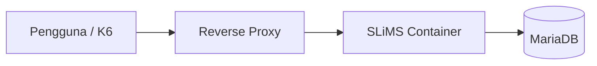
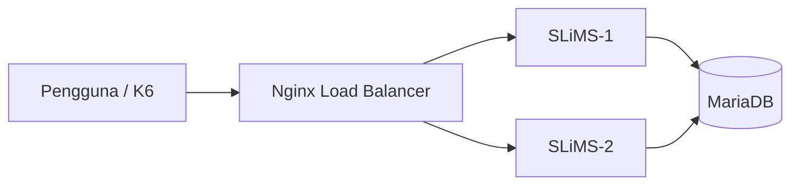

# BAB IV HASIL DAN PEMBAHASAN

Bab ini membahas proses perancangan, pengembangan, implementasi, serta evaluasi sistem yang dibangun pada penelitian. Pembahasan dilakukan berdasarkan pendekatan **Design and Development Research (DDR)** yang menempatkan proses pengembangan sebagai bagian penting dalam menghasilkan produk yang dapat diuji secara empiris (Richey & Klein, 2007).

Penelitian ini berangkat dari kondisi menurunnya performa sistem otomasi perpustakaan ketika menerima akses pengguna dalam jumlah besar secara bersamaan. Kondisi tersebut menyebabkan peningkatan waktu tanggap serta berpotensi menurunkan kualitas layanan kepada pemustaka.

Berdasarkan teori yang telah dibahas pada Bab II, kondisi tersebut berkaitan dengan hukum keempat Noruzi yaitu **Save the time of the user**, yang menekankan pentingnya efisiensi waktu akses pengguna terhadap sumber daya informasi (Noruzi, 2004). Selain itu, kebutuhan pengembangan infrastruktur juga berkaitan dengan hukum kelima yaitu **The Web is a growing organism**, yang menjelaskan bahwa sistem harus mampu berkembang mengikuti pertumbuhan pengguna dan data.

Untuk menjawab kebutuhan tersebut, penelitian ini menerapkan pendekatan **Load Balancer** sebagai mekanisme distribusi trafik menuju beberapa layanan aplikasi secara bersamaan. Secara teoritis, pendekatan ini dapat meningkatkan utilisasi sumber daya, memperbaiki waktu tanggap, serta mendukung konsep **High Availability** (Nance & Hay, 2020; F5 Networks, 2024).

---

# 4.1 Spesifikasi Lingkungan Pengujian

Pengembangan sistem dilakukan menggunakan pendekatan **laboratory testing** sebagaimana telah dijelaskan pada Bab III.

Lingkungan pengujian dibangun menggunakan teknologi containerisasi agar konfigurasi sistem dapat direplikasi secara konsisten serta memudahkan proses pengembangan dan evaluasi.

Arsitektur pengujian terdiri atas beberapa komponen yang saling terhubung dalam jaringan internal.

### Tabel 4.1 Spesifikasi Implementasi Pengujian

| Komponen              | Jumlah | Fungsi                       |
| --------------------- | -----: | ---------------------------- |
| Container SLiMS       |      2 | Menjalankan layanan aplikasi |
| Container Database    |      1 | Menyimpan data               |
| Load Balancer (Nginx) |      1 | Distribusi trafik            |
| Docker Engine         |      1 | Virtualisasi                 |
| Tool Pengujian        |     K6 | Simulasi beban               |

Seluruh container aplikasi dikonfigurasi menggunakan spesifikasi sumber daya yang setara agar hasil pengujian tidak dipengaruhi oleh perbedaan kapasitas komputasi.

---

# 4.2 Perancangan Topologi Sistem

Tahap berikutnya adalah penyusunan rancangan arsitektur yang akan digunakan sebagai dasar implementasi.

Pada penelitian ini dibuat dua rancangan topologi yang digunakan sebagai pembanding, yaitu arsitektur **monolitik** dan arsitektur **load balancing**.

---

## 4.2.1 Rancangan Topologi Monolitik

Rancangan pertama menggunakan pendekatan monolitik.

Pada pendekatan ini seluruh permintaan pengguna diproses oleh satu layanan aplikasi yang terhubung langsung ke basis data.

Arsitektur ini dipilih sebagai kondisi awal (*baseline*) untuk memperoleh gambaran performa sistem sebelum dilakukan pengembangan.

Secara teoritis, pendekatan monolitik memiliki implementasi yang sederhana namun memiliki keterbatasan dalam skalabilitas dan toleransi kegagalan karena seluruh layanan terpusat pada satu titik (Erl, 2013).

**Gambar 4.2 Rancangan Topologi Monolitik**

---

## 4.2.2 Rancangan Topologi Load Balancer

Rancangan kedua merupakan pengembangan dari sistem awal dengan menerapkan mekanisme load balancing.

Pada pendekatan ini seluruh permintaan pengguna diterima terlebih dahulu oleh **Load Balancer (Nginx)** sebelum diteruskan menuju beberapa layanan aplikasi.

Distribusi beban dilakukan menuju dua container aplikasi yang menggunakan basis data yang sama.

Pendekatan ini dipilih karena secara teoritis mampu meningkatkan kemampuan sistem dalam menangani akses simultan serta mendukung prinsip **High Availability** melalui pengurangan titik kegagalan tunggal (F5 Networks, 2024).

**Gambar 4.3 Rancangan Topologi Load Balancer**

---

# 4.3 Implementasi Sistem

Setelah rancangan topologi selesai disusun, tahap berikutnya adalah implementasi sistem ke lingkungan laboratorium.

Implementasi dilakukan sesuai rancangan yang telah dibuat dengan membangun layanan aplikasi menggunakan container.

---

## 4.3.1 Implementasi Arsitektur Monolitik

Tahap pertama dilakukan implementasi sistem menggunakan satu container aplikasi dan satu database.

Tujuan implementasi ini adalah memperoleh data performa awal.

### 4.5.1.1 Membuat Jaringan Docker 

### 4.5.1.2 Menjalankan _image database_

### 4.5.1.3 Status _service database_

### 4.5.1.4 Menjalankan _image sistem otomasi perpustakaan_

### 4.5.1.5 Status _service sistem otomasi perpustakaan_

### 4.5.1.6 Memindahkan folder sistem otomasi perpustakaan

### 4.5.1.7 Konfigurasi _stress test_

---

## 4.3.2 Implementasi Arsitektur Load Balancing

Tahap implementasi dilakukan dengan mengembangkan sistem dari pendekatan layanan tunggal menjadi layanan terdistribusi.

Pada konfigurasi ini, pengguna tidak lagi mengakses aplikasi secara langsung, melainkan seluruh permintaan terlebih dahulu diterima oleh reverse proxy yang bertindak sebagai Load Balancer.

Load balancer kemudian mendistribusikan permintaan menuju dua container aplikasi SLiMS yang berjalan secara paralel.

Pendekatan ini dipilih karena memiliki beberapa keunggulan secara teoritis, yaitu:

1. Mengurangi penumpukan beban pada satu layanan.
2. Meningkatkan ketersediaan sistem.
3. Meningkatkan kemampuan sistem dalam menangani akses simultan.
4. Mendukung skalabilitas horizontal.

Distribusi beban pada penelitian ini menggunakan pendekatan pembagian permintaan yang bertujuan menjaga pemerataan penggunaan sumber daya antar layanan.

### (TEMPAT SCREENSHOT IMPLEMENTASI LOAD BALANCER)

**Gambar 4.5 Implementasi Sistem Load Balancing**

---

# 4.4 Hasil Pengujian Sistem

Setelah proses implementasi selesai dilakukan, tahap berikutnya adalah pengujian sistem untuk memperoleh data empiris mengenai performa layanan.

Pengujian dilakukan menggunakan aplikasi K6 dengan metode load testing untuk mensimulasikan sejumlah pengguna yang melakukan akses secara bersamaan terhadap halaman utama sistem.

Skenario pengujian ditetapkan sebagai berikut.

### Tabel 4.2 Skenario Pengujian

| Parameter    |        Nilai |
| ------------ | -----------: |
| Virtual User |          500 |
| Durasi       |      4 menit |
| Metode       | Load Testing |
| Tool         |           K6 |

Berdasarkan hasil implementasi dan pengujian yang telah dilakukan, sistem menunjukkan kemampuan untuk menangani akses simultan dengan tingkat keberhasilan yang tinggi. Distribusi permintaan yang dilakukan oleh load balancer menyebabkan beban kerja tidak terpusat pada satu layanan sehingga waktu tanggap sistem menjadi lebih stabil.

Hasil tersebut menunjukkan bahwa pendekatan distribusi layanan mampu meningkatkan efisiensi pemanfaatan sumber daya dan mendukung ketersediaan layanan pada kondisi trafik yang meningkat.

Selain itu, tidak ditemukan kondisi single point of failure selama proses pengujian berlangsung karena permintaan dapat diteruskan ke layanan lain yang masih tersedia.

Temuan tersebut sejalan dengan konsep High Availability yang menekankan kemampuan sistem untuk mempertahankan layanan meskipun terjadi perubahan kondisi operasional (F5 Networks, 2024).

## 4.6.1 Menjalankan Pengujian Monolitik

## 4.6.1 Hasil Pengujian Monolitik

**Gambar 4.4 Hasil Pengujian Monolitik**

Berdasarkan hasil pengujian monolitik diperoleh bahwa:

Total request berhasil diproses sebesar 27.306 request
Tingkat keberhasilan pengujian sebesar 99,39%
Request gagal sebesar 0,60%
Rata-rata waktu respons sebesar 1,09 detik
Persentil ke-95 (P95) sebesar 84,56 ms

Hasil tersebut menunjukkan bahwa ketika beban meningkat hingga 500 pengguna virtual secara bersamaan, sistem monolitik mulai menunjukkan keterbatasan kapasitas yang ditandai dengan meningkatnya waktu respons dan munculnya request yang gagal diproses.

## 4.6.2 Menjalankan Pengujian Load Balancer

## 4.6.2 Hasil Pengujian Load Balancer

**Gambar 4.4 Hasil Pengujian Load Balancer**

Berdasarkan hasil pengujian load balancing diperoleh bahwa:

Total request berhasil diproses sebesar 53.561 request
Tingkat keberhasilan mencapai 100%
Tidak ditemukan request gagal
Rata-rata waktu respons sebesar 11,31 ms
Persentil ke-95 (P95) sebesar 19,27 ms

Hasil tersebut menunjukkan bahwa distribusi beban berhasil meningkatkan kemampuan sistem dalam menangani permintaan secara simultan.

### Tabel 4.3 Perbandingan Hasil Pengujian

| Indikator         | Monolitik | Load Balancing |
| ----------------- | --------: | -------------: |
| Total Request     |    27.306 |         53.561 |
| Success Rate      |    99,39% |           100% |
| Failed Request    |     0,60% |             0% |
| Avg Response Time |    1,09 s |       11,31 ms |
| P95               |  84,56 ms |       19,27 ms |

---

# 4.5 Kesimpulan Hasil Pengembangan

Berdasarkan hasil implementasi dan pengujian yang dilakukan, dapat diketahui bahwa pengembangan sistem menggunakan pendekatan load balancing memberikan peningkatan terhadap kemampuan layanan dalam menangani akses pengguna secara simultan.

Penerapan dua container aplikasi dan satu container database yang didistribusikan melalui load balancer berhasil menghasilkan sistem yang lebih fleksibel dibandingkan pendekatan layanan tunggal.

Dari sudut pandang Design and Development Research, penelitian ini tidak hanya menghasilkan artefak berupa implementasi sistem, tetapi juga menghasilkan temuan empiris mengenai pengaruh distribusi beban terhadap performa sistem otomasi perpustakaan.

Hasil tersebut memperlihatkan bahwa mekanisme load balancing dapat menjadi alternatif pengembangan infrastruktur untuk mendukung prinsip Save the time of the user dan The Web is a growing organism, sebagaimana dikemukakan oleh Noruzi (2004).

---

### Referensi

Richey, R. C., & Klein, J. D. (2007). *Design and Development Research: Methods, Strategies, and Issues*. Routledge.

Noruzi, A. (2004). *Application of Ranganathan’s Laws to the Web*. Webology.
