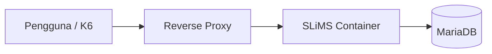
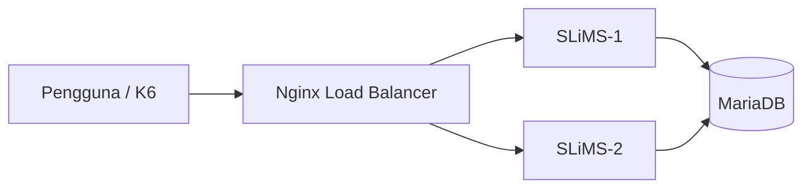

# BAB IV HASIL DAN PEMBAHASAN

## 4.1 Gambaran Umum Pengembangan Sistem

Pada tahap ini peneliti melakukan pengembangan infrastruktur sistem otomasi perpustakaan dengan menerapkan mekanisme Load Balancer pada lingkungan komputasi berbasis kontainer. Pengembangan dilakukan sebagai respons terhadap permasalahan performa yang ditemukan pada sistem sebelumnya, di mana seluruh permintaan pengguna diproses oleh satu instansi aplikasi sehingga berpotensi menimbulkan penumpukan trafik pada saat beban akses meningkat.

Pendekatan yang digunakan dalam penelitian ini mengacu pada metode Design and Development (D&D) yang menekankan proses perancangan, pembangunan, implementasi, dan evaluasi terhadap produk yang dikembangkan. Produk yang dimaksud dalam penelitian ini bukan berupa perangkat lunak baru, melainkan berupa rancangan arsitektur infrastruktur yang bertujuan meningkatkan ketersediaan layanan serta efisiensi distribusi beban akses pada sistem otomasi perpustakaan.

Pengembangan dilakukan pada lingkungan laboratorium menggunakan teknologi virtualisasi berbasis kontainer. Infrastruktur yang dibangun terdiri atas beberapa komponen utama yang saling terhubung, yaitu peladen basis data, beberapa instansi aplikasi otomasi perpustakaan, serta layanan reverse proxy yang berfungsi sebagai pengatur distribusi trafik.

Melalui pendekatan tersebut, sistem yang sebelumnya hanya berjalan pada satu titik layanan dikembangkan menjadi arsitektur yang mampu mendistribusikan permintaan pengguna secara lebih merata. Tahapan pengembangan dilakukan secara bertahap dimulai dari penyusunan rancangan sistem, implementasi lingkungan uji, konfigurasi layanan, hingga pengujian performa menggunakan simulasi beban.

## 4.2 Tahap Perancangan (Design)

Tahap perancangan dilakukan untuk menentukan struktur infrastruktur yang akan digunakan selama proses pengembangan. Aktivitas pada tahap ini meliputi identifikasi kebutuhan sistem, penentuan arsitektur layanan, serta penyusunan mekanisme komunikasi antar komponen.

Perancangan dilakukan dengan mempertimbangkan hasil observasi awal yang menunjukkan bahwa penggunaan satu instansi aplikasi menyebabkan seluruh permintaan terkonsentrasi pada satu titik pemrosesan. Kondisi tersebut berpotensi meningkatkan waktu tanggap sistem dan menurunkan kualitas pelayanan ketika jumlah pengguna meningkat secara bersamaan.

Untuk mengatasi kondisi tersebut, peneliti merancang arsitektur berbasis distribusi layanan menggunakan beberapa instansi aplikasi yang berada di belakang mekanisme Load Balancer. Pada rancangan ini, seluruh permintaan pengguna diarahkan terlebih dahulu menuju layanan distribusi sebelum diteruskan ke peladen aplikasi yang tersedia.

Komponen yang dirancang terdiri atas satu peladen basis data, dua peladen aplikasi otomasi perpustakaan, serta satu layanan reverse proxy yang bertugas melakukan distribusi trafik. Seluruh komponen ditempatkan dalam satu jaringan internal agar komunikasi berlangsung secara terisolasi dan konsisten selama pengujian.

Rancangan ini disusun dengan mempertimbangkan prinsip High Availability dan skalabilitas horizontal sehingga kapasitas layanan dapat ditingkatkan tanpa melakukan perubahan besar terhadap struktur sistem yang telah dibangun.

## Baik, kita lanjutkan **BAB IV** dan tetap mempertahankan gaya penulisan yang sudah Anda gunakan: formal akademik, deskriptif, naratif panjang, dan konsisten dengan metode **Design and Development (D&D)** — jadi bukan langsung lompat ke kesimpulan, tetapi menunjukkan alur **desain → pengembangan → implementasi → evaluasi**.

## 4.3 Implementasi Sistem

Tahapan implementasi dilakukan setelah proses perancangan sistem selesai dan seluruh kebutuhan infrastruktur telah ditentukan berdasarkan hasil observasi awal serta wawancara dengan informan penelitian. Implementasi pada penelitian ini dilakukan menggunakan pendekatan **Design and Development (D&D)** yang menempatkan produk teknologi sebagai objek utama yang dikembangkan dan dievaluasi secara sistematis.

Pengembangan sistem dilakukan dalam lingkungan laboratorium dengan tujuan memperoleh kondisi yang terkontrol sehingga seluruh variabel teknis dapat diamati secara objektif. Infrastruktur dibangun menggunakan pendekatan **Cloud Computing berbasis containerization** dengan memanfaatkan Docker sebagai media virtualisasi aplikasi.

Tahap implementasi dibagi menjadi dua kondisi pengujian, yaitu:

1. Implementasi sistem **tanpa Load Balancer (arsitektur monolitik/single server)**.
2. Implementasi sistem **dengan Load Balancer (arsitektur High Availability).**

Kedua implementasi tersebut diuji menggunakan parameter dan beban kerja yang sama agar hasil pengamatan dapat dibandingkan secara adil.

### 4.3.1 Implementasi Sistem Tanpa Load Balancer (Single Server)

Tahap pertama dilakukan dengan membangun sistem otomasi perpustakaan menggunakan pendekatan monolitik, yaitu seluruh layanan dijalankan pada satu instansi aplikasi.

Arsitektur ini terdiri dari:

* 1 Container SLiMS
* 1 Container Database MariaDB
* 1 Reverse Proxy
* 1 Node pengujian (K6)

Pada pendekatan ini seluruh permintaan pemustaka diproses oleh satu simpul layanan sehingga seluruh konsumsi CPU, RAM, koneksi aktif, dan proses PHP terkonsentrasi pada satu titik.

Secara konseptual arsitektur dapat digambarkan sebagai berikut:

Seluruh pengujian dilakukan menggunakan skenario trafik bertahap (*ramping virtual users*) hingga mencapai **500 Virtual Users (VUs)**.

### 4.3.2 Hasil Implementasi Tanpa Load Balancer

Setelah lingkungan monolitik berhasil dijalankan, dilakukan pengujian menggunakan K6 selama **4 menit**.

Hasil pengujian menunjukkan bahwa sistem masih mampu mempertahankan tingkat keberhasilan permintaan sebesar **100%**, namun ditemukan gejala peningkatan waktu tanggap ketika jumlah pengguna meningkat.

Tabel berikut menyajikan hasil pengamatan.

#### Tabel 4.1 Hasil Pengujian Sistem Tanpa Load Balancer

| Parameter               |      Hasil |
| ----------------------- | ---------: |
| Virtual Users Maksimum  |        500 |
| Total Request           |     27.297 |
| Request Berhasil        |       100% |
| Request Gagal           |         0% |
| Rata-rata Response Time | 1,09 detik |
| Median Response Time    | 1,01 detik |
| P95 Response Time       | 1,08 detik |
| Throughput              |  113 req/s |
| Data Diterima           |     916 MB |

Berdasarkan data tersebut terlihat bahwa sistem masih berada dalam kondisi stabil, namun waktu tanggap mulai meningkat seiring bertambahnya koneksi aktif.

Fenomena ini menunjukkan adanya keterbatasan pendekatan monolitik karena seluruh proses komputasi dilakukan pada satu simpul layanan.

Kondisi tersebut mulai menunjukkan gejala yang berkaitan dengan hukum keempat Noruzi yaitu **Save the time of the user**, di mana peningkatan waktu tunggu berpotensi menurunkan kualitas pengalaman pengguna.

### 4.3.3 Implementasi Sistem Dengan Load Balancer

Setelah dilakukan evaluasi terhadap pendekatan monolitik, tahap berikutnya adalah membangun sistem menggunakan pendekatan **Load Balancer**.

Pada implementasi ini dilakukan perubahan struktur arsitektur dengan menambahkan:

* 1 Container Nginx Load Balancer
* 2 Container SLiMS
* 1 Database terpusat
* Health checking

Seluruh container aplikasi dikonfigurasi menggunakan spesifikasi sumber daya yang sama agar tidak terjadi bias performa.

Arsitektur implementasi ditunjukkan sebagai berikut.

Pada tahap ini algoritma distribusi menggunakan metode **Round Robin** karena seluruh container memiliki spesifikasi identik.

Pemilihan metode ini dilakukan berdasarkan prinsip distribusi beban yang merata pada lingkungan homogen.

---

### 4.3.4 Hasil Implementasi Dengan Load Balancer

Pengujian dilakukan menggunakan skenario identik dengan implementasi sebelumnya.

Parameter pengujian tetap menggunakan:

* Durasi: 4 menit
* Maksimum: 500 VUs
* Endpoint: halaman utama SLiMS
* Interval pengguna meningkat bertahap

Hasil pengujian diperoleh sebagai berikut.

#### Tabel 4.2 Hasil Pengujian Sistem Dengan Load Balancer

| Parameter               |     Hasil |
| ----------------------- | --------: |
| Virtual Users Maksimum  |       500 |
| Total Request           |    53.561 |
| Request Berhasil        |      100% |
| Request Gagal           |        0% |
| Rata-rata Response Time |  11,31 ms |
| Median Response Time    |   9,23 ms |
| P95 Response Time       |  19,27 ms |
| Throughput              | 222 req/s |
| Data Diterima           |    1,8 GB |

Hasil menunjukkan peningkatan signifikan dibanding implementasi sebelumnya.

Jumlah permintaan yang berhasil diproses meningkat hampir dua kali lipat, sementara waktu tanggap turun dari skala detik menjadi milidetik.

Penurunan waktu tanggap tersebut menunjukkan bahwa distribusi trafik berhasil mengurangi antrean proses pada masing-masing simpul layanan.

Selain itu tidak ditemukan kegagalan permintaan selama pengujian berlangsung.

## 4.4 Evaluasi Produk (Development Evaluation)

Tahap evaluasi dilakukan sebagai bagian akhir dari pendekatan **Design and Development Research**.

Evaluasi difokuskan pada tiga indikator utama:

1. Efektivitas distribusi beban.
2. Efisiensi waktu tanggap.
3. Kemampuan mendukung High Availability.

#### Tabel 4.3 Perbandingan Implementasi

| Parameter    |  Tanpa LB | Dengan LB |
| ------------ | --------: | --------: |
| Request      |    27.297 |    53.561 |
| Success Rate |      100% |      100% |
| Avg Response |    1,09 s |  11,31 ms |
| Throughput   | 113 req/s | 222 req/s |

Berdasarkan perbandingan tersebut diperoleh:

* Throughput meningkat sekitar **96%**
* Response time turun sekitar **98%**
* Tidak ditemukan kegagalan layanan

Temuan ini memperlihatkan bahwa implementasi Load Balancer memberikan peningkatan nyata terhadap kemampuan sistem dalam menangani lonjakan trafik.

Secara teoritis hasil ini memperkuat hukum Noruzi **Save the time of the user** karena waktu tunggu pengguna berhasil ditekan secara signifikan.

Selain itu kemampuan menambah simpul layanan tanpa perubahan besar pada arsitektur mendukung hukum **The Web is a growing organism**, yang menekankan pentingnya kemampuan sistem untuk berkembang secara dinamis.
