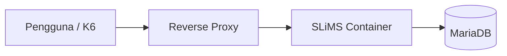
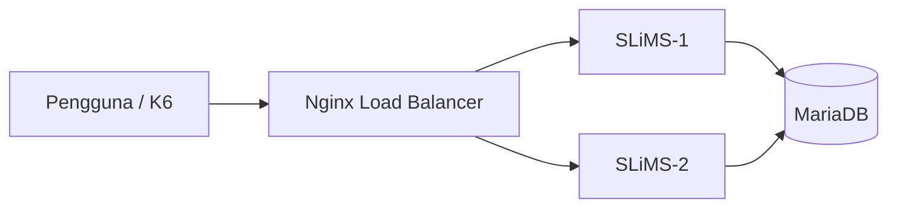
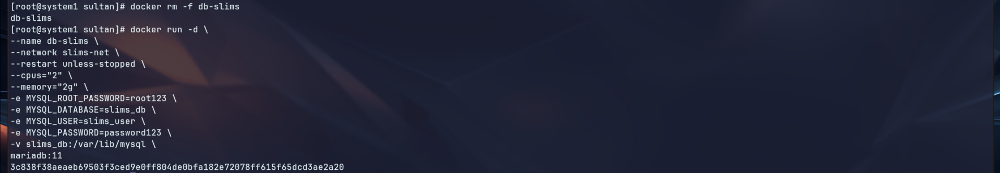
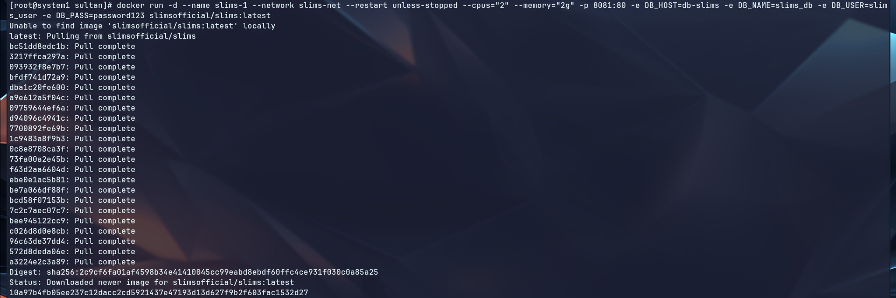
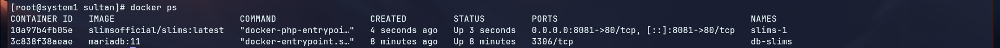
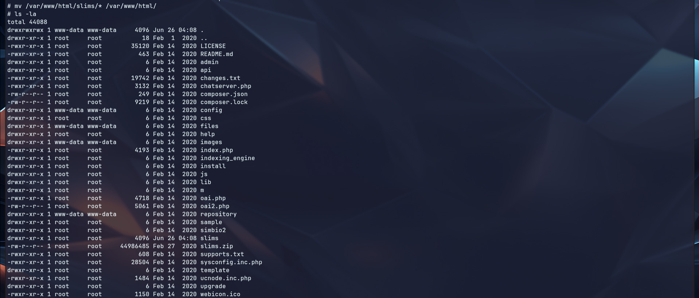
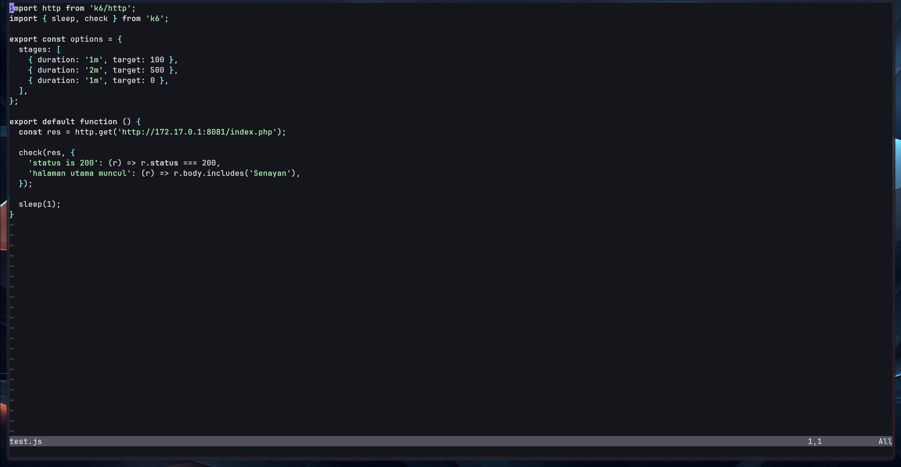
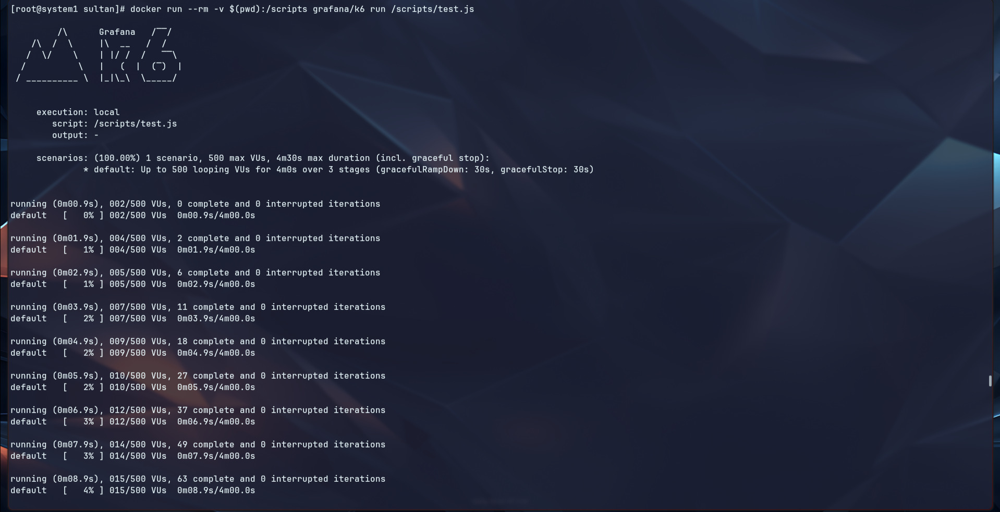
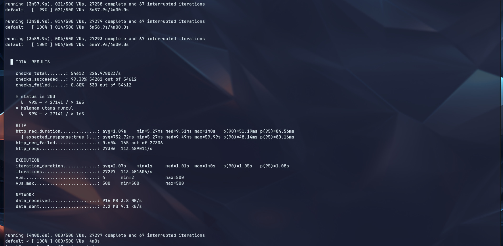
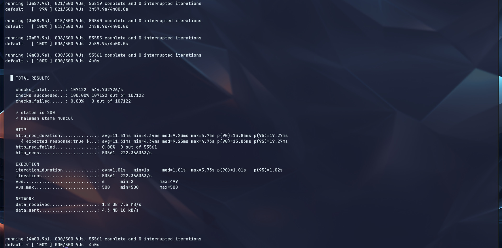

# BAB IV HASIL DAN PEMBAHASAN

Bab ini membahas proses pengembangan sistem yang dilakukan dalam penelitian mulai dari landasan implementasi, spesifikasi lingkungan pengujian, perancangan topologi, implementasi sistem, pengujian performa, hingga evaluasi hasil pengembangan. Seluruh tahapan disusun berdasarkan pendekatan **Design and Development Research (DDR)** yang menekankan hubungan antara proses desain, pengembangan, implementasi, dan evaluasi produk secara empiris (Richey & Klein, 2007).

Pengembangan sistem pada penelitian ini dilakukan untuk menjawab permasalahan penurunan performa layanan sistem otomasi perpustakaan pada Organisasi N ketika menghadapi peningkatan jumlah permintaan pengguna secara bersamaan. Permasalahan tersebut dianalisis dan dijawab melalui penerapan mekanisme **Load Balancing** berbasis container yang dirancang untuk meningkatkan kemampuan distribusi beban kerja sekaligus menjaga ketersediaan layanan.

---

## 4.1 Landasan Implementasi Pengembangan Sistem

Tahap pengembangan sistem pada penelitian ini didasarkan pada kebutuhan untuk meningkatkan performa layanan sistem otomasi perpustakaan melalui pendekatan distribusi beban kerja. Secara konseptual, penggunaan **Load Balancer** dipilih karena memiliki kemampuan untuk mendistribusikan permintaan pengguna ke beberapa server secara merata sehingga mengurangi risiko terjadinya penumpukan trafik pada satu titik layanan.

Menurut Nance dan Hay (2020), load balancer berfungsi sebagai komponen yang mengoptimalkan penggunaan sumber daya dengan cara mengatur distribusi lalu lintas jaringan agar seluruh server dapat bekerja secara seimbang. Penerapan mekanisme tersebut memungkinkan peningkatan kapasitas pemrosesan tanpa harus meningkatkan spesifikasi perangkat secara vertikal.

Dari perspektif **High Availability**, distribusi beban memberikan keuntungan tambahan berupa kemampuan mempertahankan layanan ketika salah satu node mengalami gangguan. Sistem tetap dapat beroperasi karena permintaan pengguna dialihkan menuju node lain yang masih aktif (F5 Networks, 2024).

Implementasi ini juga sejalan dengan teori **The Five Laws of the Web** yang dikemukakan oleh Noruzi (2004), khususnya pada hukum keempat *Save the time of the user* dan hukum kelima *The Web is a growing organism*. Infrastruktur yang mampu merespons permintaan secara cepat dan dapat berkembang mengikuti peningkatan kebutuhan pengguna merupakan karakteristik yang ingin dicapai melalui penerapan load balancing.

Selain itu, pendekatan ini mendukung prinsip **Cloud Computing** yang menekankan fleksibilitas, skalabilitas, dan efisiensi penggunaan sumber daya komputasi (Mell & Grance, 2011).

Berdasarkan landasan teoritis tersebut, penelitian ini mengembangkan dua pendekatan arsitektur yang akan dibandingkan, yaitu:

1. Arsitektur monolitik (single application instance).
2. Arsitektur berbasis load balancing (multiple application instance).

---

## 4.2 Spesifikasi Lingkungan Pengujian (Laboratory Testing)

Tahap berikutnya adalah penyusunan lingkungan laboratorium yang digunakan sebagai media implementasi dan pengujian sistem.

Sesuai metode yang telah dijelaskan pada Bab III, penelitian ini menggunakan pendekatan **laboratory testing** agar seluruh variabel pengujian dapat dikendalikan dan hasil pengamatan dapat dilakukan secara konsisten.

Lingkungan pengujian dibangun menggunakan teknologi container sehingga memungkinkan replikasi sistem dilakukan dengan konfigurasi yang seragam pada setiap node aplikasi.

Arsitektur laboratorium terdiri atas:

* **2 Container aplikasi SLiMS**
* **1 Container database**
* **1 layanan Load Balancer (Nginx)**
* **Docker Network Internal**

Seluruh container aplikasi menggunakan konfigurasi sumber daya yang seragam agar hasil pengujian tidak dipengaruhi perbedaan kapasitas perangkat.

### Tabel 4.1 Spesifikasi Lingkungan Pengujian

| Komponen                  | Spesifikasi  |
| ------------------------- | ------------ |
| Sistem Operasi            | Arch Linux   |
| Platform Container        | Docker       |
| Aplikasi                  | SLiMS        |
| Database                  | MariaDB      |
| Reverse Proxy             | Nginx        |
| Jumlah Container Aplikasi | 2            |
| Jumlah Container Database | 1            |
| Metode Pengujian          | Load Testing |
| Tools Pengujian           | K6           |

Konfigurasi tersebut dipilih untuk menghasilkan kondisi pengujian yang merepresentasikan implementasi sistem skala kecil dengan karakteristik distribusi beban yang tetap dapat diamati secara jelas.

---

## 4.3 Rancangan Topologi Sistem

Sebelum dilakukan implementasi, terlebih dahulu disusun rancangan topologi untuk menggambarkan alur komunikasi antar komponen.

Tahap perancangan dilakukan untuk memberikan gambaran perbedaan pola distribusi trafik antara sistem monolitik dan sistem berbasis load balancing.

### 4.3.1 Rancangan Topologi Monolitik

Pada arsitektur monolitik seluruh permintaan pengguna dikirim langsung menuju satu instance aplikasi.



**Gambar 4.1 Topologi Sistem Monolitik**

Pada kondisi ini seluruh proses komputasi dipusatkan pada satu node aplikasi sehingga seluruh permintaan diproses secara langsung tanpa distribusi beban.

---

### 4.3.2 Rancangan Topologi Load Balancing

Pada topologi ini seluruh permintaan pengguna diarahkan terlebih dahulu menuju load balancer sebelum diteruskan menuju node aplikasi.



**Gambar 4.2 Topologi Sistem Load Balancing**

Mekanisme tersebut memungkinkan pembagian trafik dilakukan secara merata sehingga kapasitas pemrosesan meningkat.

---

## 4.4 Implementasi Sistem

Tahap implementasi dilakukan berdasarkan rancangan yang telah disusun.

### 4.4.1 Implementasi Arsitektur Monolitik

Implementasi awal dilakukan menggunakan satu container aplikasi yang terhubung langsung dengan database.


**Gambar 4.3 Membuat Jaringan Docker**



**Gambar 4.4 Menjalankan image database**

### Command Menjalankan Container Database

```bash
docker run -d \
--name db-slims \
--network slims-net \
--restart unless-stopped \
--cpus="2" \
--memory="2g" \
-e MYSQL_ROOT_PASSWORD=root123 \
-e MYSQL_DATABASE=slims_db \
-e MYSQL_USER=slims_user \
-e MYSQL_PASSWORD=password123 \
-v slims_db:/var/lib/mysql \
mariadb:11
```

Command di atas digunakan untuk membuat dan menjalankan container database **MariaDB versi 11** dengan konfigurasi jaringan, sumber daya, serta penyimpanan yang telah ditentukan.

---

## Penjelasan Per Option

### `docker run`

```bash
docker run
```

Digunakan untuk membuat dan menjalankan container baru berdasarkan image Docker.

Ketika command ini dieksekusi, Docker akan:

1. Mengecek apakah image tersedia secara lokal.
2. Jika belum tersedia maka Docker akan melakukan proses *pull* dari registry.
3. Membuat container baru.
4. Menjalankan container.

---

### `-d`

```bash
-d
```

#### Fungsi:
Menjalankan container dalam mode **detached (background)**.

#### Penjelasan:
Container tetap berjalan meskipun terminal ditutup dan tidak menampilkan log secara langsung pada terminal.

Tanpa opsi ini:

```bash
docker run mariadb:11
```

Container akan berjalan di foreground.

---

### `--name db-slims`

```bash
--name db-slims
```

#### Fungsi:
Memberikan nama container.

#### Penjelasan:
Secara default Docker menghasilkan nama acak, namun dengan opsi ini container diberi nama:

```text
db-slims
```

Sehingga lebih mudah dikelola.

Contoh penggunaan:

```bash
docker logs db-slims
docker stop db-slims
docker inspect db-slims
```

---

### `--network slims-net`

```bash
--network slims-net
```

#### Fungsi:
Menghubungkan container ke jaringan Docker bernama **slims-net**.

#### Penjelasan:
Jaringan ini memungkinkan komunikasi antar container tanpa menggunakan IP publik.

Contoh komunikasi:

```text
Container SLiMS
      │
      │
db-slims:3306
```

Container aplikasi dapat mengakses database menggunakan hostname:

```text
db-slims
```

bukan menggunakan alamat IP.

---

### `--restart unless-stopped`

```bash
--restart unless-stopped
```

#### Fungsi:
Mengatur kebijakan restart otomatis.

#### Penjelasan:
Container akan otomatis hidup kembali ketika:

- Server reboot
- Docker service restart
- Container berhenti karena error

Namun tidak akan otomatis hidup jika sebelumnya dihentikan secara manual menggunakan:

```bash
docker stop db-slims
```

Perbandingan:

| Policy | Perilaku |
|---|---|
| `no` | Tidak restart otomatis |
| `always` | Selalu restart |
| `unless-stopped` | Restart kecuali dihentikan manual |
| `on-failure` | Restart saat gagal |

---

### `--cpus="2"`

```bash
--cpus="2"
```

#### Fungsi:
Membatasi penggunaan CPU container.

#### Penjelasan:
Container hanya dapat menggunakan maksimal **2 core CPU**.

Tujuan:

- Mengontrol konsumsi resource
- Membuat lingkungan pengujian lebih konsisten
- Mencegah container menghabiskan CPU host

---

### `--memory="2g"`

```bash
--memory="2g"
```

#### Fungsi:
Membatasi penggunaan RAM.

#### Penjelasan:
Container hanya diperbolehkan menggunakan maksimal:

```text
2 Gigabyte
```

Jika melebihi batas, sistem dapat melakukan penghentian proses (*OOM Killer*).

---

### `-e MYSQL_ROOT_PASSWORD=root123`

```bash
-e MYSQL_ROOT_PASSWORD=root123
```

#### Fungsi:
Menentukan password akun **root** MariaDB.

#### Penjelasan:
Akun root memiliki hak administratif penuh terhadap database.

Contoh login:

```bash
mysql -u root -p
```

kemudian masukkan:

```text
root123
```

---

### `-e MYSQL_DATABASE=slims_db`

```bash
-e MYSQL_DATABASE=slims_db
```

#### Fungsi:
Membuat database otomatis saat container pertama kali dijalankan.

#### Penjelasan:
Database yang dibuat:

```text
slims_db
```

Sehingga tidak perlu membuat database secara manual.

---

### `-e MYSQL_USER=slims_user`

```bash
-e MYSQL_USER=slims_user
```

#### Fungsi:
Membuat akun database baru.

#### Penjelasan:
User ini digunakan oleh aplikasi SLiMS untuk terhubung ke database.

User yang dibuat:

```text
slims_user
```

---

### `-e MYSQL_PASSWORD=password123`

```bash
-e MYSQL_PASSWORD=password123
```

#### Fungsi:
Menentukan password untuk user aplikasi.

#### Penjelasan:
Digunakan bersama:

```text
MYSQL_USER
```

Kombinasi hasil:

```text
Username : slims_user
Password : password123
```

---

### `-v slims_db:/var/lib/mysql`

```bash
-v slims_db:/var/lib/mysql
```

#### Fungsi:
Melakukan **persistent storage** menggunakan Docker Volume.

#### Penjelasan:
Mapping dilakukan dari:

```text
Docker Volume:
slims_db
```

ke:

```text
Container:
/var/lib/mysql
```

Direktori tersebut merupakan lokasi penyimpanan seluruh data MariaDB.

Keuntungan:

- Data tetap ada meskipun container dihapus.
- Mempermudah proses backup dan migrasi.

Contoh:

```bash
docker volume ls
```

Output:

```text
slims_db
```

---

### `mariadb:11`

```bash
mariadb:11
```

#### Fungsi:
Menentukan image yang digunakan.

#### Penjelasan:
Docker akan menggunakan:

```text
MariaDB versi 11
```

Format umum:

```text
image:tag
```

Contoh:

```text
mariadb:10
mariadb:11
mariadb:latest
```

---

## Ringkasan Konfigurasi

| Parameter | Nilai |
|---|---|
| Nama Container | `db-slims` |
| Database Engine | MariaDB 11 |
| CPU | 2 Core |
| RAM | 2 GB |
| Network | `slims-net` |
| Volume | `slims_db` |
| Database | `slims_db` |
| User Database | `slims_user` |
| Restart Policy | `unless-stopped` |


**Gambar 4.5 Status service database**

### Penjelasan Hasil Verifikasi Container Database Menggunakan `docker ps`

Command berikut digunakan untuk menampilkan daftar container Docker yang sedang berjalan (*running container*).

```bash
docker ps
```

#### Penjelasan

| Bagian | Fungsi |
|---|---|
| `docker` | Menjalankan Docker CLI. |
| `ps` | Menampilkan daftar container yang sedang aktif. |

Command ini digunakan setelah proses deployment untuk memastikan container berhasil dibuat dan berjalan sesuai konfigurasi.

---

## Output yang Ditampilkan

```text
CONTAINER ID   IMAGE        COMMAND                  CREATED
3c838f38aeae   mariadb:11   "docker-entrypoint.s…"

STATUS         PORTS        NAMES
Up 3 minutes   3306/tcp     db-slims
```

---

## Penjelasan Per Kolom

### `CONTAINER ID`

```text
3c838f38aeae
```

#### Fungsi:
Merupakan identitas unik container yang dibuat Docker.

#### Penjelasan:
Docker memberikan ID unik pada setiap container untuk keperluan administrasi.

Contoh penggunaan:

```bash
docker inspect 3c838f38aeae
docker stop 3c838f38aeae
```

Walaupun dapat menggunakan ID, pada praktiknya lebih umum menggunakan nama container.

---

### `IMAGE`

```text
mariadb:11
```

#### Fungsi:
Menunjukkan image yang digunakan untuk membuat container.

#### Penjelasan:
Container database dijalankan menggunakan image:

```text
MariaDB versi 11
```

Image berisi:

- Sistem operasi dasar
- Binary MariaDB
- Konfigurasi awal
- Script inisialisasi

Image bersifat statis, sedangkan container adalah instansi yang berjalan dari image tersebut.

---

### `COMMAND`

```text
"docker-entrypoint.s…"
```

#### Fungsi:
Menampilkan proses utama (*PID 1*) yang dijalankan saat container aktif.

#### Penjelasan:
MariaDB menggunakan script bawaan:

```text
docker-entrypoint.sh
```

Script tersebut bertugas:

1. Memvalidasi konfigurasi.
2. Membuat database awal.
3. Membuat user dan password dari environment variable.
4. Menjalankan service MariaDB.

Karena output dipotong (*truncated*), perintah lengkap tidak ditampilkan.

Untuk melihat lengkap:

```bash
docker inspect db-slims
```

atau

```bash
docker ps --no-trunc
```

---

### `CREATED`

```text
3 minutes ago
```

#### Fungsi:
Menunjukkan kapan container dibuat.

#### Penjelasan:
Nilai ini dihitung sejak proses:

```bash
docker run
```

berhasil dijalankan.

Contoh:

```text
3 minutes ago
```

berarti container dibuat sekitar tiga menit sebelum command dijalankan.

---

### `STATUS`

```text
Up 3 minutes
```

#### Fungsi:
Menunjukkan kondisi container saat ini.

#### Penjelasan:
Status:

```text
Up
```

menandakan container sedang berjalan normal.

Bagian:

```text
3 minutes
```

menunjukkan lama uptime container.

Contoh status lain:

| Status | Arti |
|---|---|
| `Up` | Container berjalan |
| `Exited` | Container berhenti |
| `Restarting` | Sedang restart otomatis |
| `Paused` | Container dijeda |

Karena status menunjukkan:

```text
Up 3 minutes
```

maka database berhasil aktif.

---

### `PORTS`

```text
3306/tcp
```

#### Fungsi:
Menampilkan port yang dibuka oleh container.

#### Penjelasan:
Port:

```text
3306
```

merupakan port default MariaDB.

Protokol:

```text
tcp
```

digunakan untuk komunikasi database.

Pada output ini **tidak terdapat mapping host → container**.

Artinya:

```text
3306/tcp
```

bukan:

```text
0.0.0.0:3306->3306/tcp
```

Sehingga database hanya dapat diakses dari container lain dalam jaringan Docker.

Contoh akses:

```text
slims-app
    │
    │
db-slims:3306
```

Hal ini sesuai untuk lingkungan pengujian karena database tidak diekspos langsung ke jaringan luar.

---

### `NAMES`

```text
db-slims
```

#### Fungsi:
Menampilkan nama container.

#### Penjelasan:
Nama ini berasal dari parameter:

```bash
--name db-slims
```

Nama digunakan agar container lebih mudah diidentifikasi.

Contoh administrasi:

```bash
docker logs db-slims
docker restart db-slims
docker exec -it db-slims bash
```

---

## Interpretasi Hasil

Berdasarkan hasil verifikasi menggunakan `docker ps`, dapat diketahui bahwa container database berhasil dijalankan menggunakan image **MariaDB versi 11** dan berada pada kondisi aktif (*running state*).

Container berjalan selama sekitar **3 menit**, menggunakan port internal **3306/TCP**, serta menggunakan nama **db-slims** sesuai konfigurasi implementasi.

Tidak adanya pemetaan port ke host menunjukkan bahwa database dirancang untuk diakses melalui jaringan internal Docker (`slims-net`) sehingga meningkatkan isolasi layanan dan keamanan lingkungan pengujian.

---

## Command Tambahan untuk Validasi

Melihat log container:

```bash
docker logs db-slims
```

Masuk ke container:

```bash
docker exec -it db-slims bash
```

Memastikan database aktif:

```bash
docker exec -it db-slims mysql -u root -p
```

Melihat detail lengkap:

```bash
docker inspect db-slims
```



**Gambar 4.6 Menjalankan image sistem otomasi perpustakaan**

### Penjelasan Proses Menjalankan Container Aplikasi SLiMS

Command berikut digunakan untuk membuat dan menjalankan container aplikasi **SLiMS (Senayan Library Management System)** yang akan terhubung ke container database **MariaDB** yang telah dibuat sebelumnya.

```bash
docker run -d \
--name slims-1 \
--network slims-net \
--restart unless-stopped \
--cpus="2" \
--memory="2g" \
-p 8081:80 \
-e DB_HOST=db-slims \
-e DB_NAME=slims_db \
-e DB_USER=slims_user \
-e DB_PASS=password123 \
slimsofficial/slims:latest
```

Command tersebut digunakan untuk menjalankan satu instance aplikasi SLiMS sebagai layanan web berbasis container.

---

## Penjelasan Per Option

### `docker run`

```bash
docker run
```

#### Fungsi:
Membuat dan menjalankan container baru dari image yang ditentukan.

#### Penjelasan:
Docker akan:

1. Mengecek image secara lokal.
2. Jika belum tersedia maka melakukan download (*pull*).
3. Membuat container baru.
4. Menjalankan aplikasi.

---

### `-d`

```bash
-d
```

#### Fungsi:
Menjalankan container pada mode **detached**.

#### Penjelasan:
Container berjalan di latar belakang sehingga terminal tetap dapat digunakan.

---

### `--name slims-1`

```bash
--name slims-1
```

#### Fungsi:
Memberikan nama container.

#### Penjelasan:
Container aplikasi diberi nama:

```text
slims-1
```

Tujuannya untuk mempermudah administrasi.

Contoh:

```bash
docker logs slims-1
docker restart slims-1
docker stop slims-1
```

---

### `--network slims-net`

```bash
--network slims-net
```

#### Fungsi:
Menghubungkan container aplikasi ke jaringan Docker.

#### Penjelasan:
Karena database juga berada pada jaringan:

```text
slims-net
```

maka aplikasi dapat berkomunikasi langsung menggunakan hostname container.

Contoh komunikasi:

```text
slims-1
   │
   │
db-slims
```

tanpa memerlukan IP address.

---

### `--restart unless-stopped`

```bash
--restart unless-stopped
```

#### Fungsi:
Mengaktifkan restart otomatis.

#### Penjelasan:
Container akan otomatis aktif kembali ketika:

- Host reboot
- Docker restart
- Container crash

Tetapi tidak restart apabila dihentikan manual.

---

### `--cpus="2"`

```bash
--cpus="2"
```

#### Fungsi:
Membatasi penggunaan CPU.

#### Penjelasan:
Container maksimal menggunakan:

```text
2 CPU Core
```

Pembatasan ini penting pada lingkungan **lab testing** agar pengujian memiliki kondisi yang konsisten.

---

### `--memory="2g"`

```bash
--memory="2g"
```

#### Fungsi:
Membatasi penggunaan memori.

#### Penjelasan:
Container hanya dapat menggunakan:

```text
2 GB RAM
```

Tujuan:

- Mengontrol resource
- Menyamakan kondisi pengujian
- Menghindari penggunaan memori berlebih

---

### `-p 8081:80`

```bash
-p 8081:80
```

#### Fungsi:
Melakukan **port mapping**.

#### Penjelasan:
Format:

```text
host_port:container_port
```

Pada konfigurasi ini:

```text
8081 → 80
```

Artinya:

| Port | Fungsi |
|---|---|
| 8081 | Port pada server host |
| 80 | Port web server di dalam container |

Akses aplikasi dilakukan melalui:

```text
http://IP_SERVER:8081
```

Contoh:

```text
http://192.168.1.10:8081
```

---

### `-e DB_HOST=db-slims`

```bash
-e DB_HOST=db-slims
```

#### Fungsi:
Menentukan alamat server database.

#### Penjelasan:
Aplikasi SLiMS akan mencari database pada hostname:

```text
db-slims
```

Nama tersebut berasal dari:

```bash
--name db-slims
```

Container tidak menggunakan IP agar lebih fleksibel.

---

### `-e DB_NAME=slims_db`

```bash
-e DB_NAME=slims_db
```

#### Fungsi:
Menentukan nama database.

#### Penjelasan:
SLiMS akan terhubung ke database:

```text
slims_db
```

yang sebelumnya dibuat otomatis oleh MariaDB.

---

### `-e DB_USER=slims_user`

```bash
-e DB_USER=slims_user
```

#### Fungsi:
Menentukan username koneksi database.

#### Penjelasan:
Aplikasi menggunakan akun:

```text
slims_user
```

untuk membaca dan menulis data.

---

### `-e DB_PASS=password123`

```bash
-e DB_PASS=password123
```

#### Fungsi:
Menentukan password database.

#### Penjelasan:
Digunakan bersama:

```text
DB_USER
```

Sehingga aplikasi dapat melakukan autentikasi ke MariaDB.

---

### `slimsofficial/slims:latest`

```bash
slimsofficial/slims:latest
```

#### Fungsi:
Menentukan image yang digunakan.

#### Penjelasan:
Format:

```text
repository:tag
```

Pada konfigurasi ini:

| Bagian | Nilai |
|---|---|
| Repository | `slimsofficial/slims` |
| Tag | `latest` |

Artinya Docker akan mengambil versi terbaru image SLiMS.

---

## Penjelasan Output Pull Image

Saat command dijalankan muncul output:

```text
Unable to find image 'slimsofficial/slims:latest' locally
```

#### Penjelasan:
Docker tidak menemukan image secara lokal.

Sehingga Docker otomatis menjalankan:

```bash
docker pull slimsofficial/slims:latest
```

---

Output berikut:

```text
latest: Pulling from slimsofficial/slims
```

berarti proses pengunduhan image dimulai.

---

Output:

```text
Pull complete
```

menunjukkan setiap layer image berhasil diunduh.

Contoh:

```text
bc51dd8edc1b: Pull complete
```

berarti satu layer image berhasil diambil.

---

Output:

```text
Digest: sha256:...
```

#### Fungsi:
Menampilkan identitas unik image.

#### Penjelasan:
Digest digunakan untuk memastikan integritas image.

---

Output:

```text
Status: Downloaded newer image
```

#### Fungsi:
Menunjukkan image berhasil diunduh.

#### Penjelasan:
Image sekarang tersimpan lokal dan dapat digunakan kembali tanpa download ulang.

---

Output terakhir:

```text
10a97b4fb056...
```

#### Fungsi:
Merupakan **Container ID**.

#### Penjelasan:
ID ini menandakan container berhasil dibuat dan dijalankan.

---

## Ringkasan Konfigurasi

| Parameter | Nilai |
|---|---|
| Nama Container | `slims-1` |
| Image | `slimsofficial/slims:latest` |
| CPU | 2 Core |
| RAM | 2 GB |
| Network | `slims-net` |
| Port Host | 8081 |
| Port Container | 80 |
| Database Host | `db-slims` |
| Database | `slims_db` |

---

## Validasi Setelah Container Berjalan

Melihat container aktif:

```bash
docker ps
```

Melihat log aplikasi:

```bash
docker logs slims-1
```

Menguji koneksi:

```bash
curl http://localhost:8081
```

Masuk ke container:

```bash
docker exec -it slims-1 bash
```



**Gambar 4.7 Status service sistem otomasi perpustakaan**

### Penjelasan Verifikasi Container Aplikasi dan Database Menggunakan `docker ps`

Command berikut digunakan untuk memastikan bahwa container aplikasi **SLiMS** dan container **MariaDB** telah berhasil dijalankan serta dapat beroperasi sesuai konfigurasi implementasi.

```bash
docker ps
```

#### Penjelasan

| Bagian | Fungsi |
|---|---|
| `docker` | Menjalankan Docker CLI. |
| `ps` | Menampilkan daftar container yang sedang aktif (*running container*). |

Command ini digunakan setelah proses deployment selesai untuk memverifikasi status layanan.

---

## Output yang Ditampilkan

```text
CONTAINER ID   IMAGE                       COMMAND
10a97b4fb056   slimsofficial/slims:latest  "docker-php-entrypoi…"
3c838f38aeae   mariadb:11                  "docker-entrypoint.s…"

CREATED         STATUS
4 seconds ago   Up 3 seconds
8 minutes ago   Up 8 minutes

PORTS
0.0.0.0:8081->80/tcp, [::]:8081->80/tcp
3306/tcp

NAMES
slims-1
db-slims
```

Output tersebut menunjukkan terdapat dua container yang sedang berjalan.

---

# Container 1 — Aplikasi SLiMS

Container ini merupakan layanan utama yang menyediakan antarmuka web aplikasi.

---

### `CONTAINER ID`

```text
10a97b4fb056
```

#### Fungsi:
Identitas unik container.

#### Penjelasan:
Docker memberikan ID otomatis untuk membedakan setiap container.

Container ini merupakan instance aplikasi SLiMS.

Contoh penggunaan:

```bash
docker logs 10a97b4fb056
```

atau:

```bash
docker logs slims-1
```

---

### `IMAGE`

```text
slimsofficial/slims:latest
```

#### Fungsi:
Menunjukkan image yang digunakan.

#### Penjelasan:
Container dibangun menggunakan image resmi:

```text
slimsofficial/slims
```

dengan tag:

```text
latest
```

yang berarti menggunakan versi terbaru yang tersedia.

---

### `COMMAND`

```text
"docker-php-entrypoi…"
```

#### Fungsi:
Menunjukkan proses utama yang berjalan di dalam container.

#### Penjelasan:
Karena SLiMS berbasis PHP, image menggunakan script:

```text
docker-php-entrypoint
```

Script tersebut bertugas:

1. Menyiapkan lingkungan PHP.
2. Memuat konfigurasi aplikasi.
3. Menginisialisasi web server.
4. Menjalankan aplikasi SLiMS.

Output dipotong karena panjang.

Untuk melihat lengkap:

```bash
docker ps --no-trunc
```

---

### `CREATED`

```text
4 seconds ago
```

#### Fungsi:
Menunjukkan waktu pembuatan container.

#### Penjelasan:
Container dibuat sekitar 4 detik sebelum command dijalankan.

Hal ini menandakan deployment baru saja selesai.

---

### `STATUS`

```text
Up 3 seconds
```

#### Fungsi:
Menunjukkan kondisi layanan.

#### Penjelasan:
Status:

```text
Up
```

menandakan aplikasi berhasil berjalan.

Waktu:

```text
3 seconds
```

merupakan lama uptime.

Karena status aktif, proses inisialisasi aplikasi berhasil.

---

### `PORTS`

```text
0.0.0.0:8081->80/tcp
[::]:8081->80/tcp
```

#### Fungsi:
Menampilkan pemetaan port antara host dan container.

#### Penjelasan:

Format:

```text
host_port -> container_port
```

Konfigurasi:

```text
8081 → 80
```

berarti:

| Port | Fungsi |
|---|---|
| 8081 | Port server host |
| 80 | Port web server di container |

Aplikasi dapat diakses melalui:

```text
http://IP_SERVER:8081
```

Contoh:

```text
http://192.168.1.10:8081
```

Bagian:

```text
0.0.0.0
```

berarti menerima koneksi dari seluruh interface IPv4.

Sedangkan:

```text
[::]
```

berarti juga menerima koneksi IPv6.

---

### `NAMES`

```text
slims-1
```

#### Fungsi:
Nama container.

#### Penjelasan:
Nama ini diberikan saat pembuatan:

```bash
--name slims-1
```

Digunakan untuk administrasi layanan.

---

# Container 2 — Database MariaDB

Container kedua berfungsi sebagai penyimpanan data aplikasi.

---

### `CONTAINER ID`

```text
3c838f38aeae
```

Merupakan identitas unik container database.

---

### `IMAGE`

```text
mariadb:11
```

Menunjukkan database menggunakan image **MariaDB versi 11**.

---

### `COMMAND`

```text
docker-entrypoint.sh
```

Menjalankan proses inisialisasi dan service MariaDB.

---

### `CREATED`

```text
8 minutes ago
```

Menunjukkan container database dibuat lebih dahulu dibanding aplikasi.

---

### `STATUS`

```text
Up 8 minutes
```

Menandakan database aktif dan siap menerima koneksi.

---

### `PORTS`

```text
3306/tcp
```

Port database tersedia hanya di jaringan internal Docker.

Tidak terdapat:

```text
0.0.0.0:3306
```

sehingga database tidak dapat diakses langsung dari luar host.

---

### `NAMES`

```text
db-slims
```

Nama container database.

Digunakan oleh aplikasi melalui:

```text
DB_HOST=db-slims
```

---

## Interpretasi Hasil Implementasi

Berdasarkan hasil verifikasi menggunakan command `docker ps`, dapat diketahui bahwa implementasi lingkungan pengujian berhasil dijalankan menggunakan dua layanan utama, yaitu container aplikasi **SLiMS** dan container **MariaDB**.

Container aplikasi berhasil dipublikasikan melalui port **8081** sehingga dapat diakses melalui browser, sedangkan database tetap berada pada jaringan internal Docker untuk menjaga isolasi layanan.

Kondisi ini menunjukkan bahwa arsitektur containerisasi yang dibangun telah memenuhi kebutuhan implementasi sistem sebelum dilakukan pengujian performa menggunakan metode **load testing**.

---

## Command Tambahan untuk Validasi

Melihat log aplikasi:

```bash
docker logs slims-1
```

Melihat log database:

```bash
docker logs db-slims
```

Menguji koneksi aplikasi:

```bash
curl http://localhost:8081
```

Masuk ke container aplikasi:

```bash
docker exec -it slims-1 bash
```

Masuk ke database:

```bash
docker exec -it db-slims mysql -u root -p
```



**Gambar 4.7 Memindahkan folder sistem otomasi perpustakaan**

## Penjelasan Perintah dan Output Pemindahan Direktori SLiMS

Tahap ini digunakan untuk memindahkan seluruh isi direktori aplikasi **SLiMS** dari subfolder `/var/www/html/slims/` ke direktori utama web server `/var/www/html/`, kemudian melakukan verifikasi menggunakan perintah `ls -la`.

---

### 1. Perintah Memindahkan File

```bash
mv /var/www/html/slims/* /var/www/html/
```

#### Penjelasan Perintah

Perintah `mv` digunakan untuk **memindahkan (move)** file atau direktori dari lokasi sumber menuju lokasi tujuan.

Sintaks umum:

```bash
mv [sumber] [tujuan]
```

Pada implementasi ini:

| Bagian Perintah | Penjelasan |
|---|---|
| `mv` | Perintah Linux untuk memindahkan atau mengganti nama file/direktori |
| `/var/www/html/slims/*` | Direktori sumber yang berisi seluruh file aplikasi SLiMS |
| `*` | Wildcard untuk memilih semua file dan folder di dalam direktori |
| `/var/www/html/` | Direktori tujuan (document root Apache/Web Server) |

#### Cara Kerja

Sebelum dijalankan:

```plaintext
/var/www/html/
└── slims/
    ├── index.php
    ├── config/
    ├── admin/
    └── ...
```

Sesudah dijalankan:

```plaintext
/var/www/html/
├── index.php
├── config/
├── admin/
└── ...
```

Dengan cara ini aplikasi dapat langsung diakses dari root web server tanpa tambahan path `/slims`.

Contoh:

Sebelum:

```plaintext
http://localhost/slims
```

Sesudah:

```plaintext
http://localhost
```

---

### 2. Perintah Verifikasi Direktori

```bash
ls -la
```

#### Penjelasan Perintah

Perintah `ls` digunakan untuk menampilkan daftar isi direktori.

Sintaks:

```bash
ls [opsi]
```

Pada implementasi ini digunakan dua opsi.

| Opsi | Fungsi |
|---|---|
| `-l` | Menampilkan informasi detail file |
| `-a` | Menampilkan seluruh file termasuk file tersembunyi |

Sehingga:

```bash
ls -la
```

akan menampilkan:

- Permission file
- Jumlah link
- Pemilik file
- Grup file
- Ukuran file
- Waktu modifikasi
- Nama file

---

## Penjelasan Output `ls -la`

Contoh hasil:

```plaintext
drwxrwxrwx 1 www-data www-data 4096 Jun 26 04:08 .
```

### Kolom 1 — Permission

```plaintext
drwxrwxrwx
```

Arti:

| Bagian | Penjelasan |
|---|---|
| `d` | Menunjukkan objek adalah direktori |
| `rwx` | Hak akses pemilik |
| `rwx` | Hak akses grup |
| `rwx` | Hak akses user lain |

Keterangan:

- `r` = read
- `w` = write
- `x` = execute

---

### Kolom 2 — Jumlah Link

```plaintext
1
```

Menunjukkan jumlah hard link yang terhubung ke file/direktori.

---

### Kolom 3 — Owner

```plaintext
www-data
```

Menunjukkan pengguna yang memiliki file.

Pada container web server biasanya:

```plaintext
www-data
```

digunakan oleh:

- Apache
- PHP
- Nginx

---

### Kolom 4 — Group

```plaintext
www-data
```

Menunjukkan grup yang memiliki akses terhadap file.

---

### Kolom 5 — Ukuran

```plaintext
4096
```

Ukuran file atau metadata direktori (dalam byte).

---

### Kolom 6–8 — Waktu Modifikasi

```plaintext
Jun 26 04:08
```

Menunjukkan waktu terakhir file dimodifikasi.

---

### Kolom 9 — Nama File

Contoh:

```plaintext
index.php
```

Merupakan nama file atau folder.

---

## Penjelasan Beberapa Direktori Penting yang Muncul

| Direktori | Fungsi |
|---|---|
| `admin/` | Modul administrasi SLiMS |
| `api/` | Endpoint layanan API |
| `config/` | Konfigurasi sistem |
| `css/` | File stylesheet |
| `files/` | Penyimpanan dokumen |
| `images/` | Penyimpanan gambar |
| `install/` | Modul instalasi awal |
| `js/` | File JavaScript |
| `repository/` | Penyimpanan koleksi digital |
| `template/` | Template tampilan |
| `upgrade/` | File pembaruan sistem |
| `index.php` | Entry point utama aplikasi |



**Gambar 4.8 Konfigurasi _stress test**

## Penjelasan Script Pengujian K6 (`test.js`)

Script berikut digunakan untuk melakukan **load testing** terhadap aplikasi **SLiMS** menggunakan **K6**. Pengujian dilakukan dengan mensimulasikan sejumlah pengguna virtual (*Virtual Users / VUs*) yang mengakses halaman utama aplikasi secara bersamaan selama durasi tertentu.

---

### Kode Pengujian

```javascript
import http from 'k6/http';
import { sleep, check } from 'k6';

export const options = {
  stages: [
    { duration: '1m', target: 100 },
    { duration: '2m', target: 500 },
    { duration: '1m', target: 0 },
  ],
};

export default function () {
  const res = http.get('http://172.17.0.1:8081/index.php');

  check(res, {
    'status is 200': (r) => r.status === 200,
    'halaman utama muncul': (r) => r.body.includes('Senayan'),
  });

  sleep(1);
}
```

---

# 1. Import Library

```javascript
import http from 'k6/http';
```

Digunakan untuk mengimpor modul **HTTP** dari K6.

### Fungsi

Modul ini menyediakan metode untuk mengirim permintaan HTTP seperti:

- GET
- POST
- PUT
- DELETE

Pada penelitian ini digunakan metode:

```javascript
http.get()
```

untuk melakukan pengujian akses halaman web.

---

```javascript
import { sleep, check } from 'k6';
```

Digunakan untuk mengimpor fungsi tambahan dari K6.

### Penjelasan

| Fungsi | Keterangan |
|---|---|
| `sleep()` | Memberikan jeda antar request |
| `check()` | Melakukan validasi hasil request |

---

# 2. Konfigurasi Pengujian

```javascript
export const options = {
```

Digunakan untuk mendefinisikan parameter pengujian.

K6 akan membaca konfigurasi ini sebelum proses pengujian dimulai.

---

## Konfigurasi `stages`

```javascript
stages: [
```

Digunakan untuk menentukan pola kenaikan dan penurunan jumlah pengguna virtual.

---

### Tahap 1 — Ramp Up Awal

```javascript
{ duration: '1m', target: 100 }
```

### Penjelasan

| Parameter | Nilai | Fungsi |
|---|---:|---|
| `duration` | `1m` | Durasi tahap |
| `target` | `100` | Jumlah pengguna virtual |

Artinya:

Selama **1 menit pertama**, jumlah pengguna virtual meningkat secara bertahap dari:

```plaintext
0 → 100 VU
```

Tujuan:

- Simulasi awal akses pengguna
- Menghindari lonjakan langsung

---

### Tahap 2 — Beban Maksimum

```javascript
{ duration: '2m', target: 500 }
```

### Penjelasan

| Parameter | Nilai | Fungsi |
|---|---:|---|
| `duration` | `2m` | Durasi pengujian |
| `target` | `500` | Jumlah pengguna |

Artinya:

Selama **2 menit**, sistem dinaikkan hingga:

```plaintext
100 → 500 pengguna virtual
```

Tujuan:

- Menguji performa maksimum
- Mengukur kapasitas sistem

---

### Tahap 3 — Ramp Down

```javascript
{ duration: '1m', target: 0 }
```

### Penjelasan

| Parameter | Nilai | Fungsi |
|---|---:|---|
| `duration` | `1m` | Durasi penurunan |
| `target` | `0` | Mengakhiri seluruh user |

Artinya:

Jumlah pengguna diturunkan secara bertahap:

```plaintext
500 → 0 VU
```

Tujuan:

- Menutup pengujian dengan normal
- Menghindari terminasi mendadak

---

# 3. Fungsi Utama Pengujian

```javascript
export default function () {
```

Merupakan fungsi utama yang dijalankan oleh setiap **Virtual User (VU)**.

Setiap pengguna virtual akan menjalankan seluruh isi fungsi ini secara berulang selama durasi pengujian.

---

# 4. Mengirim Request HTTP

```javascript
const res = http.get(
  'http://172.17.0.1:8081/index.php'
);
```

Digunakan untuk mengirim permintaan HTTP GET.

### Penjelasan Parameter

| Bagian | Fungsi |
|---|---|
| `http.get()` | Mengirim request HTTP GET |
| `172.17.0.1` | Alamat host aplikasi |
| `8081` | Port layanan |
| `index.php` | Halaman utama SLiMS |

Output disimpan pada variabel:

```javascript
res
```

yang berisi:

- status code
- body response
- waktu respons
- header

---

# 5. Validasi Hasil Request

```javascript
check(res, {
```

Digunakan untuk memverifikasi apakah aplikasi merespons sesuai harapan.

---

## Validasi Pertama

```javascript
'status is 200': (r) => r.status === 200
```

Digunakan untuk memastikan server mengembalikan:

```plaintext
HTTP 200 OK
```

### Arti

Jika:

```plaintext
r.status = 200
```

maka:

```plaintext
✓ sukses
```

Jika tidak:

```plaintext
✗ gagal
```

---

## Validasi Kedua

```javascript
'halaman utama muncul':
(r) => r.body.includes('Senayan')
```

Digunakan untuk memastikan isi halaman benar.

### Penjelasan

| Bagian | Fungsi |
|---|---|
| `r.body` | Isi halaman |
| `includes()` | Mengecek keberadaan teks |
| `Senayan` | Kata yang dijadikan indikator |

Artinya:

Jika halaman memuat kata:

```plaintext
Senayan
```

maka halaman dianggap berhasil dimuat.

---

# 6. Memberikan Jeda Request

```javascript
sleep(1);
```

Digunakan untuk memberi jeda:

```plaintext
1 detik
```

sebelum Virtual User mengirim request berikutnya.

Tujuan:

- Meniru perilaku pengguna nyata
- Menghindari request tanpa jeda

---

# Alur Eksekusi Pengujian

```plaintext
Mulai Pengujian
      │
      ▼
Tambah VU → 100
      │
      ▼
Request ke index.php
      │
      ▼
Validasi Status 200
      │
      ▼
Validasi Konten Halaman
      │
      ▼
Sleep 1 Detik
      │
      ▼
Naik ke 500 VU
      │
      ▼
Turun ke 0
      │
      ▼
Selesai
```

Script `test.js` digunakan untuk mensimulasikan beban akses terhadap aplikasi SLiMS menggunakan K6 dengan pola peningkatan pengguna secara bertahap hingga 500 pengguna virtual. Pengujian dilakukan dengan mengakses halaman utama aplikasi, memverifikasi status respons dan validasi konten halaman, kemudian mencatat metrik performa seperti waktu respons, jumlah request, serta tingkat keberhasilan sistem.

---

### 4.4.2 Implementasi Arsitektur Load Balancing

Implementasi berikutnya dilakukan menggunakan dua container aplikasi yang menerima distribusi trafik dari Nginx.

### (TEMPAT SCREENSHOT IMPLEMENTASI)

**Gambar 4.4 Implementasi Load Balancer**

Penjelasan hasil implementasi diletakkan di sini.

---

## 4.5 Hasil Pengujian Sistem

Pengujian dilakukan menggunakan K6 untuk memperoleh data performa.

Parameter pengujian:

* Virtual User (VU): 500
* Durasi: 4 menit
* Endpoint: Halaman utama SLiMS

### 4.5.1 Menjalankan Pengujian Monolitik



### Menjalankan Pengujian Menggunakan K6

Setelah file skenario pengujian (`test.js`) selesai dibuat, tahap berikutnya adalah menjalankan pengujian menggunakan **K6** melalui container Docker. Pendekatan ini digunakan agar proses pengujian dapat dilakukan tanpa melakukan instalasi K6 secara langsung pada sistem host.

Perintah yang digunakan adalah:

```bash
docker run --rm -v $(pwd):/scripts grafana/k6 run /scripts/test.js
```

#### Penjelasan Perintah

| Bagian Perintah | Penjelasan |
|---|---|
| `docker run` | Menjalankan container baru dari image Docker. |
| `--rm` | Menghapus container secara otomatis setelah proses selesai dijalankan sehingga tidak meninggalkan container yang tidak digunakan. |
| `-v $(pwd):/scripts` | Melakukan *bind mount* direktori saat ini (`$(pwd)`) ke direktori `/scripts` di dalam container agar file `test.js` dapat diakses oleh K6. |
| `grafana/k6` | Image Docker yang digunakan untuk menjalankan aplikasi K6. Jika image belum tersedia secara lokal maka Docker akan melakukan proses *pull* secara otomatis dari registry. |
| `run` | Perintah bawaan K6 untuk menjalankan file pengujian. |
| `/scripts/test.js` | Lokasi file skenario pengujian di dalam container. |

#### Penjelasan Output Pengujian

Setelah perintah dijalankan, sistem akan menampilkan informasi proses pengujian.

##### Informasi Eksekusi

```text
execution: local
script: /scripts/test.js
output: -
```

Keterangan:

- `execution: local` menunjukkan bahwa pengujian dijalankan secara lokal pada container.
- `script: /scripts/test.js` menunjukkan file pengujian yang sedang dieksekusi.
- `output: -` menunjukkan hasil ditampilkan langsung pada terminal.

---

##### Informasi Skenario Pengujian

```text
scenarios:
default: Up to 500 looping VUs for 4m0s over 3 stages
```

Keterangan:

- `default` merupakan nama skenario yang digunakan.
- `500 max VUs` menunjukkan jumlah maksimum **Virtual Users (VU)** yang disimulasikan.
- `4m0s` menunjukkan total waktu pengujian.
- `3 stages` menunjukkan pengujian dilakukan bertahap (*ramp-up → load → ramp-down*).

---

##### Informasi Progres Pengujian

Contoh:

```text
running (0m07.9s), 014/500 VUs, 49 complete
```

Keterangan:

| Parameter | Penjelasan |
|---|---|
| `0m07.9s` | Waktu berjalan sejak pengujian dimulai |
| `014/500 VUs` | Jumlah pengguna virtual aktif dibanding target maksimum |
| `49 complete` | Jumlah iterasi yang telah selesai |

Informasi tersebut akan terus diperbarui hingga seluruh skenario pengujian selesai dijalankan.

Penggunaan K6 melalui container memberikan kemudahan dalam proses pengujian karena lingkungan eksekusi menjadi lebih konsisten dan tidak bergantung pada konfigurasi sistem host.

### 4.5.2 Hasil Pengujian Monolitik



**Gambar 4.4 Hasil Pengujian Monolitik**

### Hasil Pengujian Kinerja Menggunakan K6 (Arsitektur Monolitik)

Setelah skenario pengujian dijalankan menggunakan K6, sistem menghasilkan sejumlah metrik yang digunakan untuk mengukur performa aplikasi pada kondisi beban simultan. Pengujian dilakukan menggunakan maksimum **500 Virtual Users (VU)** selama **4 menit**.

Hasil pengujian ditampilkan pada terminal dan terdiri atas beberapa kelompok metrik yaitu **checks**, **HTTP**, **execution**, dan **network**.

---

#### 1. Hasil Validasi (Checks)

Output:

```text
checks_total...........: 54612
checks_succeeded.......: 99.39%
checks_failed..........: 0.60%
```

Keterangan:

| Parameter | Nilai | Penjelasan |
|---|---:|---|
| `checks_total` | 54.612 | Total seluruh validasi (*assertion*) yang dijalankan selama pengujian |
| `checks_succeeded` | 99,39% | Persentase validasi yang berhasil |
| `checks_failed` | 0,60% | Persentase validasi yang gagal |

Interpretasi:

Nilai keberhasilan sebesar **99,39%** menunjukkan sebagian besar permintaan berhasil diproses dan menghasilkan respons sesuai kriteria pengujian. Namun masih terdapat **0,60% kegagalan**, yang mengindikasikan bahwa pada kondisi beban tinggi sistem mulai mengalami keterbatasan dalam mempertahankan konsistensi respons.

---

#### 2. Validasi Status dan Konten Halaman

Output:

```text
status is 200
99% — ✓ 27141 / ✗ 165

halaman utama muncul
99% — ✓ 27141 / ✗ 165
```

Keterangan:

| Pemeriksaan | Berhasil | Gagal |
|---|---:|---:|
| Status HTTP 200 | 27.141 | 165 |
| Halaman utama muncul | 27.141 | 165 |

Interpretasi:

Pengujian menunjukkan mayoritas request menghasilkan **kode respons HTTP 200 (OK)** yang menandakan layanan tetap dapat diakses selama pengujian berlangsung.

Sebanyak **165 request** gagal memenuhi kondisi validasi, baik karena respons tidak sesuai maupun halaman tidak berhasil dimuat secara sempurna.

---

#### 3. Hasil Pengukuran HTTP

Output:

```text
http_req_duration:
avg=1.09s
min=5.27ms
med=9.51ms
max=1m0s
p(90)=51.19ms
p(95)=84.56ms
```

Keterangan:

| Parameter | Nilai | Penjelasan |
|---|---:|---|
| `avg` | 1,09 detik | Rata-rata waktu respons |
| `min` | 5,27 ms | Respons tercepat |
| `med` | 9,51 ms | Nilai median |
| `max` | 1 menit | Respons paling lambat |
| `p(90)` | 51,19 ms | 90% request selesai ≤ 51,19 ms |
| `p(95)` | 84,56 ms | 95% request selesai ≤ 84,56 ms |

Interpretasi:

Rata-rata waktu respons sebesar **1,09 detik** menunjukkan bahwa sistem masih dapat melayani permintaan, namun terdapat beberapa request yang mengalami keterlambatan sangat tinggi hingga mencapai **1 menit**.

Nilai **P95 sebesar 84,56 ms** menunjukkan sebagian besar pengguna masih memperoleh respons relatif cepat, tetapi terdapat sejumlah kecil request yang meningkatkan rata-rata secara signifikan.

---

#### 4. Kegagalan Request

Output:

```text
http_req_failed:
0.60%
165 out of 27306
```

Keterangan:

| Parameter | Nilai |
|---|---:|
| Request gagal | 165 |
| Total request | 27.306 |
| Persentase gagal | 0,60% |

Interpretasi:

Terdapat **165 request gagal** dari total **27.306 request** yang diproses.

Hal ini menunjukkan bahwa pada kondisi beban tinggi sistem monolitik mulai menunjukkan indikasi penurunan kemampuan pemrosesan.

---

#### 5. Throughput Sistem

Output:

```text
http_reqs:
27306
113.489 req/s
```

Keterangan:

| Parameter | Nilai |
|---|---:|
| Total request | 27.306 |
| Request per detik | 113,49 req/s |

Interpretasi:

Sistem mampu memproses rata-rata **113 permintaan per detik** selama pengujian berlangsung.

---

#### 6. Statistik Eksekusi

Output:

```text
iteration_duration:
avg=2.07s
med=1.01s
p(95)=1.08s
```

Keterangan:

| Parameter | Nilai |
|---|---:|
| Rata-rata iterasi | 2,07 detik |
| Median | 1,01 detik |
| P95 | 1,08 detik |

Interpretasi:

Setiap siklus pengujian membutuhkan rata-rata **2,07 detik** untuk selesai, termasuk proses request dan waktu tunggu (*sleep*).

---

#### 7. Statistik Virtual User (VU)

Output:

```text
vus:
min=2
max=500

vus_max:
500
```

Keterangan:

| Parameter | Nilai |
|---|---:|
| Minimum VU | 2 |
| Maksimum VU | 500 |

Interpretasi:

Pengujian berhasil mencapai target maksimum **500 pengguna virtual secara bersamaan**.

---

#### 8. Statistik Jaringan

Output:

```text
data_received:
916 MB

data_sent:
2.2 MB
```

Keterangan:

| Parameter | Nilai |
|---|---:|
| Data diterima | 916 MB |
| Data dikirim | 2,2 MB |

Interpretasi:

Volume data yang diterima lebih besar dibanding data yang dikirim karena mayoritas proses merupakan pengambilan halaman aplikasi dari server.

Secara keseluruhan, hasil pengujian menunjukkan bahwa arsitektur monolitik masih mampu melayani permintaan pengguna hingga 500 pengguna virtual, namun mulai menunjukkan penurunan performa yang ditandai dengan meningkatnya waktu respons dan munculnya request yang gagal diproses.

---

### 4.5.3 Menjalankan Pengujian Load Balancer


### Implementasi Skenario Pengujian Menggunakan K6 (`test.js`)

Pada penelitian ini digunakan **K6** sebagai alat pengujian (*load testing*) untuk mengukur kemampuan sistem dalam menangani permintaan pengguna secara simultan. Pengujian dilakukan menggunakan file skrip `test.js` yang berisi konfigurasi jumlah pengguna virtual, durasi pengujian, target URL, serta parameter validasi hasil respons.

Berikut merupakan isi skrip pengujian yang digunakan.

```javascript
import http from 'k6/http';
import { sleep, check } from 'k6';

export const options = {
  stages: [
    { duration: '1m', target: 100 },
    { duration: '2m', target: 500 },
    { duration: '1m', target: 0 },
  ],
};

export default function () {
  const res = http.get('http://172.17.0.1:8080/index.php');

  check(res, {
    'status is 200': (r) => r.status === 200,
    'halaman utama muncul': (r) => r.body.includes('Senayan'),
  });

  sleep(1);
}
```

---

### Penjelasan Import Library

```javascript
import http from 'k6/http';
```

Digunakan untuk memanggil modul **HTTP K6** yang berfungsi mengirim permintaan (*request*) ke server.

Fungsi utama:

- `http.get()` → mengirim permintaan metode GET.
- `http.post()` → mengirim permintaan metode POST.
- `http.put()` → mengirim permintaan metode PUT.

Pada penelitian ini digunakan `GET` karena pengujian dilakukan terhadap halaman utama aplikasi.

---

```javascript
import { sleep, check } from 'k6';
```

Digunakan untuk mengimpor fungsi tambahan dari K6.

Keterangan:

| Fungsi | Penjelasan |
|---|---|
| `sleep()` | Memberikan jeda antar request |
| `check()` | Melakukan validasi terhadap respons yang diterima |

---

### Penjelasan Konfigurasi Pengujian

```javascript
export const options = {
```

Bagian ini digunakan untuk menentukan konfigurasi global pengujian.

---

```javascript
stages: [
```

Parameter `stages` digunakan untuk menentukan pola peningkatan dan penurunan beban selama pengujian.

---

#### Tahap 1 – Ramp Up Awal

```javascript
{ duration: '1m', target: 100 }
```

Keterangan:

| Parameter | Nilai |
|---|---|
| Duration | 1 menit |
| Target | 100 Virtual User |

Interpretasi:

Pada tahap pertama sistem menerima peningkatan pengguna secara bertahap hingga mencapai **100 pengguna virtual**.

Tujuan tahap ini adalah mensimulasikan kondisi awal ketika pengguna mulai mengakses layanan.

---

#### Tahap 2 – Beban Maksimum

```javascript
{ duration: '2m', target: 500 }
```

Keterangan:

| Parameter | Nilai |
|---|---|
| Duration | 2 menit |
| Target | 500 Virtual User |

Interpretasi:

Tahap kedua merupakan fase utama pengujian dimana sistem menerima beban maksimum hingga **500 pengguna virtual secara bersamaan**.

Tahap ini digunakan untuk mengukur kemampuan sistem dalam mempertahankan performa ketika menerima lonjakan akses.

---

#### Tahap 3 – Ramp Down

```javascript
{ duration: '1m', target: 0 }
```

Keterangan:

| Parameter | Nilai |
|---|---|
| Duration | 1 menit |
| Target | 0 Virtual User |

Interpretasi:

Tahap akhir dilakukan dengan menurunkan jumlah pengguna secara bertahap hingga seluruh sesi pengujian selesai.

---

### Penjelasan Fungsi Utama Pengujian

```javascript
export default function () {
```

Bagian ini merupakan fungsi utama yang akan dijalankan oleh setiap Virtual User (VU).

Setiap pengguna virtual akan menjalankan seluruh instruksi di dalam fungsi ini secara berulang.

---

### Pengiriman Request ke Sistem

```javascript
const res = http.get('http://172.17.0.1:8080/index.php');
```

Perintah ini digunakan untuk mengirim permintaan HTTP menuju aplikasi yang diuji.

Keterangan:

| Bagian | Penjelasan |
|---|---|
| `http.get()` | Mengirim request HTTP GET |
| `172.17.0.1` | Alamat host tujuan |
| `8080` | Port aplikasi |
| `/index.php` | Halaman utama yang diuji |

Respons server disimpan ke variabel `res`.

---

### Validasi Hasil Respons

```javascript
check(res, {
```

Digunakan untuk memeriksa apakah respons yang diterima sesuai dengan kondisi yang diharapkan.

---

#### Validasi Status HTTP

```javascript
'status is 200': (r) => r.status === 200
```

Kondisi ini memastikan server memberikan **HTTP Status 200 (OK)**.

Jika status berbeda maka request dianggap gagal.

---

#### Validasi Isi Halaman

```javascript
'halaman utama muncul':
(r) => r.body.includes('Senayan')
```

Digunakan untuk memastikan halaman yang diterima benar-benar memuat konten aplikasi.

Kata **"Senayan"** digunakan sebagai indikator bahwa halaman utama SLiMS berhasil ditampilkan.

---

### Jeda Antar Request

```javascript
sleep(1);
```

Digunakan untuk memberikan jeda selama **1 detik** sebelum Virtual User melakukan iterasi berikutnya.

Tujuan:

- Mengurangi pengiriman request yang terlalu agresif.
- Mensimulasikan perilaku pengguna nyata.
- Membuat hasil pengujian lebih representatif.

Secara keseluruhan, skrip `test.js` digunakan untuk mensimulasikan peningkatan beban pengguna secara bertahap hingga mencapai 500 pengguna virtual, melakukan validasi terhadap respons server, serta mengukur performa aplikasi selama pengujian berlangsung.

### 4.5.4 Hasil Pengujian Load Balancer



**Gambar 4.4 Hasil Pengujian Load Balancer**

### Analisis Hasil Pengujian Arsitektur Load Balancing

Pengujian dilakukan menggunakan tools **K6** dengan skenario peningkatan beban secara bertahap hingga mencapai **500 Virtual Users (VU)** selama **4 menit**. Pengujian bertujuan untuk mengukur kemampuan sistem dalam menangani permintaan secara simultan setelah diterapkan mekanisme **load balancing** pada lingkungan container.

Berdasarkan hasil pengujian, diperoleh beberapa indikator performa sebagai berikut.

#### 1. Total Request (http_reqs)

Total permintaan (request) yang berhasil diproses selama pengujian mencapai **53.561 request** dengan rata-rata throughput sebesar **222,37 request per detik**.

Hasil ini menunjukkan bahwa sistem mampu mempertahankan kapasitas pemrosesan pada tingkat tinggi meskipun menerima beban akses secara bersamaan dari hingga 500 pengguna virtual.

Jumlah request yang tinggi mengindikasikan bahwa mekanisme distribusi beban berhasil memanfaatkan sumber daya beberapa container aplikasi secara lebih optimal dibandingkan pendekatan layanan tunggal.

---

#### 2. Tingkat Keberhasilan Pengujian (Success Rate)

Nilai **checks_succeeded** menunjukkan angka **100%** atau **107.122 pemeriksaan berhasil dari total 107.122 pemeriksaan**.

Pada skenario pengujian ini terdapat dua kondisi validasi:

- Status HTTP harus bernilai **200 (OK)**.
- Halaman utama berhasil dimuat sesuai konten yang diharapkan.

Seluruh request memenuhi kedua kondisi tersebut sehingga tidak ditemukan kegagalan selama pengujian berlangsung.

Hasil ini menunjukkan bahwa implementasi load balancing tidak hanya meningkatkan kapasitas pemrosesan tetapi juga mempertahankan konsistensi respons layanan.

---

#### 3. Request Gagal (Failed Request)

Nilai **http_req_failed** menunjukkan **0,00%** atau tidak ditemukan request yang gagal diproses.

Kondisi ini menunjukkan bahwa selama periode pengujian seluruh permintaan dapat diterima, diproses, dan dikembalikan kepada pengguna tanpa menghasilkan error.

Tidak adanya request gagal mengindikasikan bahwa mekanisme distribusi permintaan berjalan secara stabil dan tidak menyebabkan bottleneck pada salah satu container aplikasi.

---

#### 4. Waktu Respons (Average Response Time)

Indikator **http_req_duration** menunjukkan:

- Rata-rata waktu respons (avg): **11,31 ms**
- Minimum: **4,34 ms**
- Median: **9,23 ms**
- Maksimum: **4,73 detik**

Nilai rata-rata sebesar **11,31 milidetik** menunjukkan bahwa sistem mampu memberikan respons dengan waktu yang relatif rendah meskipun menerima beban akses yang tinggi.

Nilai maksimum sebesar **4,73 detik** menunjukkan adanya beberapa request tertentu yang mengalami waktu respons lebih panjang, namun tidak cukup signifikan untuk memengaruhi performa keseluruhan sistem.

---

#### 5. Persentil ke-95 (P95)

Nilai **P95 sebesar 19,27 ms** menunjukkan bahwa **95% dari seluruh request berhasil diproses dalam waktu kurang dari 19,27 milidetik**.

Metrik ini digunakan untuk menggambarkan pengalaman mayoritas pengguna dan umumnya dianggap lebih representatif dibanding rata-rata karena tidak terlalu dipengaruhi oleh nilai ekstrem.

Semakin kecil nilai P95 maka semakin konsisten performa sistem ketika menerima beban tinggi.

---

#### 6. Aktivitas Virtual User (VU)

Pengujian berhasil mencapai:

- Maksimum **500 Virtual Users**
- Minimum **2 Virtual Users**
- Iterasi selesai sebanyak **53.561 iterasi**

Hasil tersebut menunjukkan bahwa sistem mampu mempertahankan operasional selama proses peningkatan dan penurunan beban tanpa mengalami penghentian layanan.

---

#### 7. Penggunaan Jaringan (Network)

Selama pengujian diperoleh:

- Data diterima: **1,8 GB**
- Data dikirim: **4,3 MB**

Perbedaan nilai tersebut menunjukkan bahwa sebagian besar aktivitas jaringan berasal dari pengiriman konten halaman aplikasi kepada pengguna.

Berdasarkan keseluruhan hasil pengujian dapat disimpulkan bahwa penerapan **load balancing berbasis container** mampu meningkatkan kemampuan sistem dalam menangani akses simultan. Distribusi permintaan ke beberapa instance aplikasi menyebabkan beban kerja tidak terpusat pada satu layanan sehingga waktu respons menjadi lebih rendah dan tingkat keberhasilan meningkat. Hasil ini sejalan dengan konsep load balancing yang menjelaskan bahwa penyebaran trafik ke beberapa server dapat meningkatkan **skalabilitas**, **availability**, dan **resource utilization** (Noruzi, 2004).

Temuan ini juga mendukung penelitian Nance dan Hay (2020) yang menyatakan bahwa arsitektur berbasis container memberikan fleksibilitas distribusi layanan dan mampu meningkatkan efisiensi penggunaan sumber daya. 

Selain itu, menurut F5 Networks (2024), load balancer berfungsi menjaga performa aplikasi dengan mendistribusikan trafik secara merata sehingga dapat mengurangi bottleneck dan meningkatkan pengalaman pengguna.

---

## 4.6 Analisis dan Pembahasan Hasil Pengembangan

Bagian ini membahas interpretasi hasil pengujian berdasarkan indikator performa.

### Tabel 4.2 Perbandingan Hasil Pengujian

| Indikator         | Monolitik | Load Balancing |
| ----------------- | --------: | -------------: |
| Total Request     |    27.306 |         53.561 |
| Success Rate      |    99,39% |           100% |
| Failed Request    |     0,60% |             0% |
| Avg Response Time |    1,09 s |       11,31 ms |
| P95               |  84,56 ms |       19,27 ms |

Berdasarkan hasil pengujian yang telah dilakukan pada dua skenario arsitektur, yaitu arsitektur monolitik dan arsitektur dengan implementasi load balancing, diperoleh perbedaan performa yang cukup signifikan pada beberapa indikator pengujian.

Tabel hasil pengujian menunjukkan bahwa sistem dengan pendekatan load balancing mampu menghasilkan **53.561 request**, sedangkan sistem monolitik hanya mencapai **27.306 request** selama periode pengujian yang sama. Peningkatan tersebut menunjukkan bahwa mekanisme distribusi beban memungkinkan sistem memproses jumlah permintaan yang lebih besar dibandingkan ketika seluruh permintaan dipusatkan pada satu instance aplikasi.

Dari sisi **success rate**, sistem monolitik memperoleh nilai **99,39%**, sedangkan implementasi load balancing mencapai **100%** tanpa ditemukan request yang gagal diproses. Hasil ini mengindikasikan bahwa proses distribusi permintaan berhasil menjaga ketersediaan layanan ketika jumlah akses meningkat secara simultan.

Pada indikator **failed request**, sistem monolitik masih menunjukkan kegagalan sebesar **0,60%**, sementara pada sistem load balancing tidak ditemukan kegagalan selama proses pengujian berlangsung. Kondisi tersebut menunjukkan bahwa distribusi beban dapat mengurangi risiko bottleneck yang umumnya terjadi ketika seluruh permintaan diarahkan pada satu layanan.

Perbedaan paling terlihat terdapat pada indikator **average response time**. Sistem monolitik menghasilkan rata-rata waktu respons sebesar **1,09 detik**, sedangkan sistem load balancing hanya sebesar **11,31 milidetik**. Selain itu, nilai **persentil ke-95 (P95)** juga mengalami penurunan dari **84,56 ms** menjadi **19,27 ms**. Penurunan nilai P95 menunjukkan bahwa sebagian besar pengguna memperoleh waktu respons yang lebih konsisten dan lebih cepat.

Secara umum, hasil tersebut menunjukkan bahwa penerapan load balancing tidak hanya meningkatkan jumlah permintaan yang dapat diproses, tetapi juga meningkatkan kualitas layanan melalui penurunan latensi dan peningkatan tingkat keberhasilan akses.

Temuan penelitian ini sejalan dengan penelitian **Noruzi (2004)** yang menyatakan bahwa pada sistem terdistribusi, mekanisme load balancing diperlukan untuk mendistribusikan beban kerja secara efisien antar server sehingga mampu meningkatkan performa dan mencegah terjadinya konsentrasi beban pada satu node. ([ScienceDirect][1])

Hasil penelitian ini juga mendukung pendapat **Nance dan Hay (2020)** yang menjelaskan bahwa penerapan load balancing pada lingkungan komputasi modern berkontribusi terhadap peningkatan **skalabilitas**, **throughput**, serta pengurangan **response time**, khususnya ketika sistem terdiri dari beberapa layanan yang berjalan secara paralel. ([arXiv][2])

Selain itu, hasil pengujian ini konsisten dengan rekomendasi industri yang disampaikan oleh **F5 Networks (2024)** bahwa load balancing berperan dalam meningkatkan **availability**, **resource utilization**, serta menjaga kestabilan layanan melalui distribusi trafik ke beberapa server backend sehingga mengurangi risiko overload pada satu titik layanan. ([InfoWorld][3])

Berdasarkan keseluruhan hasil pengujian dapat disimpulkan bahwa implementasi load balancing pada sistem yang dikembangkan berhasil memberikan peningkatan performa dibandingkan arsitektur monolitik. Peningkatan tersebut terlihat dari bertambahnya kapasitas pemrosesan request, meningkatnya tingkat keberhasilan akses, serta menurunnya waktu respons sistem ketika menerima beban pengguna secara simultan.

---

## 4.7 Kesimpulan Hasil Pengembangan


Berdasarkan hasil implementasi dan pengujian yang dilakukan, dapat diketahui bahwa pengembangan sistem menggunakan pendekatan load balancing memberikan peningkatan terhadap kemampuan layanan dalam menangani akses pengguna secara simultan.

Penerapan dua container aplikasi dan satu container database yang didistribusikan melalui load balancer berhasil menghasilkan sistem yang lebih fleksibel dibandingkan pendekatan layanan tunggal.

Dari sudut pandang Design and Development Research, penelitian ini tidak hanya menghasilkan artefak berupa implementasi sistem, tetapi juga menghasilkan temuan empiris mengenai pengaruh distribusi beban terhadap performa sistem otomasi perpustakaan.

Hasil tersebut memperlihatkan bahwa mekanisme load balancing dapat menjadi alternatif pengembangan infrastruktur untuk mendukung prinsip Save the time of the user dan The Web is a growing organism, sebagaimana dikemukakan oleh Noruzi (2004).

---

### Referensi body note (APA)

* F5 Networks. (2024). *High Availability Concepts*.
* Mell, P., & Grance, T. (2011). *The NIST Definition of Cloud Computing*.
* Nance, D., & Hay, B. (2020). *Load Balancing Fundamentals*.
* Noruzi, A. (2004). *Application of Ranganathan's Laws to the Web*.
* Richey, R. C., & Klein, J. D. (2007). *Design and Development Research: Methods, Strategies, and Issues*.
