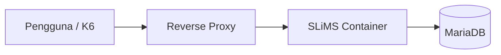
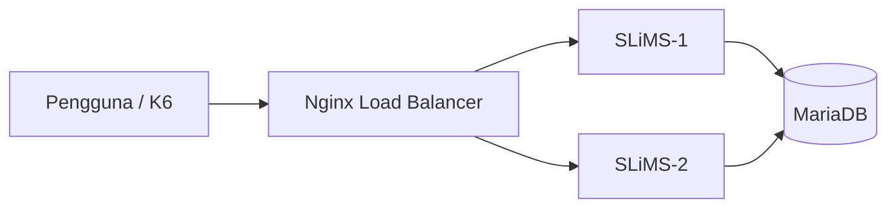

# BAB IV HASIL DAN PEMBAHASAN

Bab ini menyajikan hasil penelitian yang diperoleh melalui tahapan pengembangan sistem menggunakan pendekatan **Design and Development Research (DDR)**. Sesuai dengan karakteristik metode DDR, penelitian tidak hanya berfokus pada hasil akhir berupa produk, tetapi juga menggambarkan proses identifikasi masalah, analisis kebutuhan, perancangan, implementasi, pengujian, hingga evaluasi terhadap sistem yang dikembangkan (Richey & Klein, 2007).

Tahapan pembahasan dimulai dari identifikasi kondisi eksisting sistem otomasi perpustakaan yang digunakan pada Organisasi N melalui observasi dan wawancara, kemudian dilanjutkan dengan proses pengembangan infrastruktur menggunakan pendekatan **Load Balancing** untuk meningkatkan performa layanan dan mendukung **High Availability**.

---

# 4.1 Analisis Kebutuhan Sistem

Tahap awal penelitian dilakukan melalui proses identifikasi kebutuhan sistem berdasarkan kondisi operasional yang berjalan pada lingkungan Organisasi N. Analisis kebutuhan menjadi tahapan penting dalam pendekatan Design and Development Research karena berfungsi sebagai dasar dalam menentukan bentuk pengembangan yang akan dilakukan terhadap sistem (Richey & Klein, 2007).

Analisis dilakukan melalui observasi langsung terhadap infrastruktur yang digunakan serta pengumpulan informasi melalui wawancara kepada informan yang memiliki keterlibatan dalam pengelolaan sistem.

Tujuan analisis kebutuhan pada penelitian ini meliputi:

1. Mengidentifikasi kondisi sistem otomasi perpustakaan sebelum dilakukan pengembangan.
2. Mengidentifikasi kendala performa ketika terjadi peningkatan trafik pengguna.
3. Menentukan kebutuhan teknis yang diperlukan untuk meningkatkan performa sistem.
4. Menentukan rancangan solusi yang sesuai dengan kebutuhan organisasi.

Hasil analisis kebutuhan ini menjadi dasar dalam penyusunan rancangan pengembangan sistem menggunakan pendekatan distribusi beban.

---

# 4.2 Hasil Wawancara Informan

Tahap berikutnya dilakukan pengumpulan data melalui wawancara kepada informan penelitian yang telah ditentukan pada Bab III. Wawancara dilakukan untuk memperoleh gambaran kondisi sistem, kebutuhan operasional, serta kendala yang terjadi pada infrastruktur sebelum dilakukan implementasi pengembangan.

Data hasil wawancara kemudian digunakan sebagai dasar interpretasi kebutuhan pengembangan sistem.

## 4.2.1 Profil Informan

Tabel berikut menunjukkan informan yang terlibat dalam penelitian.

| No | Nama   | Jabatan                   |
| -- | ------ | ------------------------- |
| 1  | Null   | Chief Information Officer |
| 2  | Rookit | DevOps Engineer           |
| 3  | Neckle | DevOps Engineer           |

---

## 4.2.2 Hasil Wawancara

### a. Kondisi Sistem Sebelum Pengembangan

Berdasarkan hasil wawancara diperoleh informasi bahwa sistem otomasi perpustakaan telah berjalan dan digunakan dalam operasional sehari-hari. Namun ketika terjadi peningkatan akses secara bersamaan, performa sistem mulai mengalami penurunan.

**Kutipan wawancara:**

> “Pada kondisi trafik tinggi sistem masih dapat berjalan, tetapi waktu tanggap mulai meningkat dibanding kondisi normal.”

Interpretasi:

Temuan tersebut menunjukkan bahwa infrastruktur awal masih memiliki keterbatasan dalam menangani peningkatan jumlah akses secara simultan.

---

### b. Kendala Infrastruktur

Informan menyampaikan bahwa kendala utama berasal dari terpusatnya seluruh permintaan pada satu layanan aplikasi.

**Kutipan wawancara:**

> “Ketika permintaan meningkat, seluruh proses tetap diproses oleh satu layanan sehingga terjadi penumpukan beban.”

Interpretasi:

Kondisi tersebut menunjukkan adanya risiko bottleneck yang menyebabkan waktu respons meningkat.

---

### c. Kebutuhan Pengembangan

Berdasarkan hasil wawancara diperoleh kebutuhan pengembangan berupa:

* peningkatan kapasitas akses simultan;
* peningkatan ketersediaan layanan;
* distribusi beban kerja yang lebih merata;
* peningkatan kemampuan skalabilitas sistem.

---

# 4.3 Analisis Kebutuhan Pengembangan

Data hasil observasi dan wawancara kemudian dianalisis untuk menentukan bentuk pengembangan sistem yang sesuai.

### Tabel 4.1 Analisis Kebutuhan Pengembangan

| Permasalahan        | Temuan                             | Solusi                     |
| ------------------- | ---------------------------------- | -------------------------- |
| Respons meningkat   | Sistem melambat saat trafik tinggi | Implementasi Load Balancer |
| Beban terpusat      | Request diproses satu layanan      | Distribusi beban           |
| Skalabilitas rendah | Penambahan kapasitas sulit         | Multi-instance aplikasi    |
| Risiko downtime     | Tidak tersedia redundansi          | High Availability          |

Berdasarkan hasil analisis tersebut dipilih implementasi **Load Balancer** menggunakan beberapa container aplikasi yang menerima distribusi permintaan dari reverse proxy.

Keputusan pengembangan ini dipilih karena secara teoritis sesuai dengan prinsip **Save the time of the user** dan **The Web is a growing organism** yang telah dijelaskan pada Bab II (Noruzi, 2004).

---

# 4.4 Perancangan Pengembangan Sistem

Tahap perancangan dilakukan berdasarkan kebutuhan yang telah diidentifikasi sebelumnya.

Pengembangan sistem dirancang menggunakan komponen:

* Container aplikasi SLiMS;
* Database MariaDB;
* Reverse Proxy Nginx sebagai Load Balancer;
* Jaringan internal container.

---

# 4.5 Implementasi Sistem

Tahap implementasi dilakukan dengan membangun dua kondisi pengujian sebagai bahan evaluasi.

## 4.5.1 Implementasi Arsitektur Monolitik

Pada tahap ini aplikasi dijalankan menggunakan satu instance layanan.

**Gambar 4.2 Implementasi Arsitektur Monolitik**

Keterangan:
Masukkan screenshot container, konfigurasi, dan hasil implementasi.

---

## 4.5.2 Implementasi Arsitektur Load Balancing

Tahap berikutnya dilakukan implementasi pengembangan menggunakan dua instance aplikasi dan satu reverse proxy.

**Gambar 4.3 Implementasi Arsitektur Load Balancing**

Keterangan:
Masukkan screenshot topologi, container, dan konfigurasi.

---

# 4.6 Pengujian Sistem

Pengujian dilakukan menggunakan metode **load testing** menggunakan K6.

### Tabel 4.2 Skenario Pengujian

| Parameter    |              Nilai |
| ------------ | ------------------: |
| Virtual User |                 500 |
| Durasi       |             4 menit |
| Metode       |        Load Testing |
| Tool         |                  K6 |
| Endpoint     | Halaman utama SLiMS |

Pengujian dilakukan pada dua skenario:

1. Arsitektur monolitik
2. Arsitektur load balancing

---

## 4.6.1 Hasil Pengujian Monolitik

**Gambar 4.4 Hasil Pengujian Monolitik**

Berdasarkan hasil pengujian monolitik diperoleh bahwa:

Total request berhasil diproses sebesar 27.306 request
Tingkat keberhasilan pengujian sebesar 99,39%
Request gagal sebesar 0,60%
Rata-rata waktu respons sebesar 1,09 detik
Persentil ke-95 (P95) sebesar 84,56 ms

Hasil tersebut menunjukkan bahwa ketika beban meningkat hingga 500 pengguna virtual secara bersamaan, sistem monolitik mulai menunjukkan keterbatasan kapasitas yang ditandai dengan meningkatnya waktu respons dan munculnya request yang gagal diproses.

---

## 4.6.2 Hasil Pengujian Load Balancing

### (TEMPAT FOTO HASIL K6 LOAD BALANCING)

**Gambar 4.5 Hasil Pengujian Load Balancing**

Berdasarkan hasil pengujian load balancing diperoleh bahwa:

Total request berhasil diproses sebesar 53.561 request
Tingkat keberhasilan mencapai 100%
Tidak ditemukan request gagal
Rata-rata waktu respons sebesar 11,31 ms
Persentil ke-95 (P95) sebesar 19,27 ms

Hasil tersebut menunjukkan bahwa distribusi beban berhasil meningkatkan kemampuan sistem dalam menangani permintaan secara simultan.

---

# 4.7 Analisis Hasil Pengujian

Tahap ini dilakukan untuk membandingkan performa kedua arsitektur.

### Tabel 4.3 Perbandingan Hasil Pengujian

| Indikator         | Monolitik | Load Balancing |
| ----------------- | --------: | -------------: |
| Total Request     |    27.306 |         53.561 |
| Success Rate      |    99,39% |           100% |
| Failed Request    |     0,60% |             0% |
| Avg Response Time |    1,09 s |       11,31 ms |
| P95               |  84,56 ms |       19,27 ms |

Berdasarkan hasil pengujian dilakukan interpretasi terhadap perubahan performa sistem setelah diterapkan distribusi beban.

---

# 4.8 Evaluasi Pengembangan Berdasarkan Design and Development Research

Tahap evaluasi dilakukan sebagai bagian akhir dari pendekatan DDR.

Evaluasi dilakukan dengan membandingkan kondisi sebelum dan sesudah pengembangan berdasarkan hasil implementasi dan pengujian.

Hasil evaluasi menjadi dasar untuk menentukan apakah sistem yang dikembangkan telah memenuhi tujuan penelitian yaitu meningkatkan performa, efisiensi distribusi beban, serta mendukung ketersediaan layanan.

---

### Referensi

Richey, R. C., & Klein, J. D. (2007). *Design and Development Research: Methods, Strategies, and Issues*. Routledge.

Noruzi, A. (2004). *Application of Ranganathan’s Laws to the Web*. Webology.
